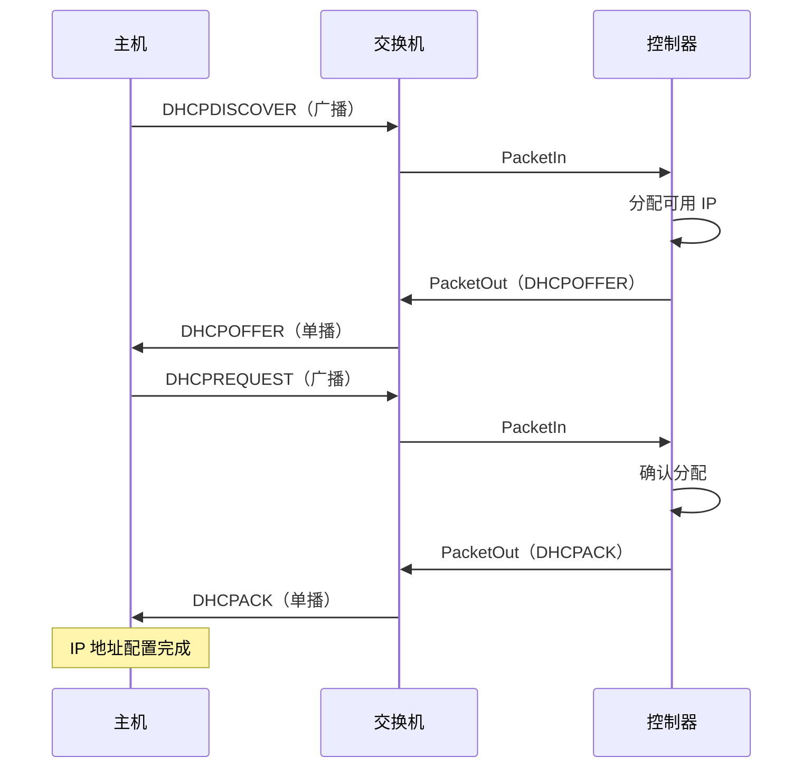

# DHCPServer

`dhcp.py` 中的 DHCP 协议实现。所有方法均为 `@classmethod`。

```python
from dhcp import DHCPServer
```

## 配置

```python
class Config():
    start_ip = '192.168.1.2'         # IP 池起始地址
    end_ip = '192.168.1.99'          # IP 池结束地址
    netmask = '255.255.255.0'        # 子网掩码
    server_ip = '192.168.1.1'        # 服务器 IP
    controller_macAddr = '7e:49:b3:f0:f9:99'  # 控制器虚拟 MAC
    dns = '8.8.8.8'                  # DNS 服务器地址
    lease_duration = 8               # 租约时长（秒）
    offer_timeout = 4                # Offer 超时（秒）
    decline_timeout = 6              # Decline 超时（秒）
```

## 主要入口

### `DHCPServer.handle_dhcp(datapath, in_port, pkt)`

根据 DHCP 报文类型分派处理：

- `DHCPDISCOVER` → 构建并发送 DHCP OFFER
- `DHCPREQUEST` → 构建并发送 DHCP ACK
- `DHCPRELEASE` → 释放 IP 回地址池
- `DHCPDECLINE` → 标记 IP 为已拒绝

## DHCP 交互流程



## IP 地址池管理

服务器维护 `[start_ip, end_ip]` 范围内的可用 IP 地址池。每个已分配的 IP 记录：

- 租约过期时间戳
- 客户端 MAC 地址
- 状态：`available`、`offered`、`allocated`、`declined`

通过超时清理机制管理租约续期和过期。
