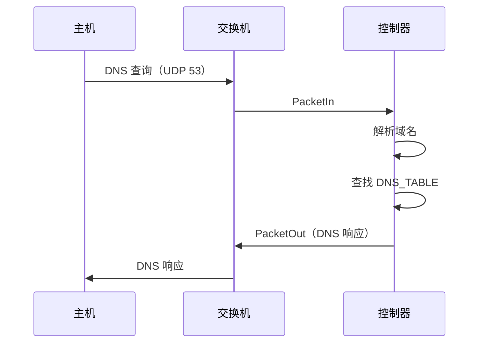

# DNSServer

`dns_server.py` 中的内置 DNS 服务器。所有方法均为 `@classmethod`。

```python
from dns_server import DNSServer
```

## 配置

```python
class DNSServer:
    DNS_SERVER_IP = "192.168.1.1"
    DNS_SERVER_MAC = "7e:49:b3:f0:f9:99"
    DNS_TABLE = {
        "h1.local": "192.168.1.2",
        "h2.local": "192.168.1.3",
        "web.local": "192.168.1.3",
    }
    DEFAULT_TTL = 60
```

## 主要入口

### `DNSServer.handle_dns(datapath, in_port, pkt)`

处理 UDP 53 端口的 DNS 查询报文：

1. 从数据包中提取 UDP 负载
2. 解析 DNS 查询中的域名
3. 在 `DNS_TABLE` 中查找域名
4. 构建并发送 DNS 响应

## DNS 查询流程



## 报文结构

响应报文的协议栈：

- **以太网帧**：源 MAC = 控制器 MAC，目标 MAC = 客户端 MAC
- **IPv4 包**：源 IP = `192.168.1.1`，目标 IP = 客户端 IP
- **UDP 数据报**：源端口 = 53，目标端口 = 客户端端口
- **DNS 负载**：包含解析后的 IP 地址
