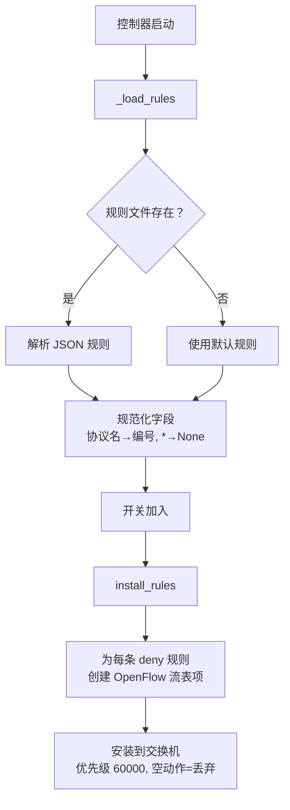

# Firewall

`firewall.py` 中基于规则的包过滤模块。

```python
from firewall import Firewall, FirewallRule
```

## FirewallRule

不可变数据类，表示单条防火墙规则：

```python
@dataclass(frozen=True)
class FirewallRule:
    src_ip: str = None      # 源 IP 地址
    dst_ip: str = None      # 目标 IP 地址
    proto: str = None       # 协议（icmp/tcp/udp）
    src_port: object = None # 源端口
    dst_port: object = None # 目标端口
    action: str = "deny"    # 动作
```

`None` 或 `"*"` 值被视为通配符，匹配任意。

## Firewall 类

```python
class Firewall:
    COOKIE = 0x305F
    PRIORITY = 60000
```

### `_load_rules()`

从 `firewall_rule.json` 加载规则，若文件不存在则使用 `DEFAULT_RULES`。
将协议名称规范化（icmp→1, tcp→6, udp→17）。

### `install_rules(dpid_to_ofctl)`

将 deny 规则转换为高优先级 OpenFlow 流表项（空动作列表 = 丢弃）。
通过 `{dpid: OfCtl}` 映射在所有交换机上安装。

## 规则文件格式

`firewall_rule.json`：

```json
{
  "rules": [
    {
      "src_ip": "192.168.117.2",
      "dst_ip": "192.168.117.3",
      "proto": "icmp",
      "src_port": "*",
      "dst_port": "*",
      "action": "deny"
    },
    {
      "src_ip": "192.168.117.2",
      "dst_ip": "192.168.117.3",
      "proto": "tcp",
      "src_port": "*",
      "dst_port": 80,
      "action": "deny"
    }
  ]
}
```

## 处理流程



## 优先级体系

| 优先级 | 用途 |
|--------|------|
| 60000 | 防火墙丢弃规则 |
| 1000 | 转发流表项 |
| 0 | Table-miss（发送至控制器） |

防火墙规则优先级高于转发规则，确保匹配到的数据包被直接丢弃而非转发。
