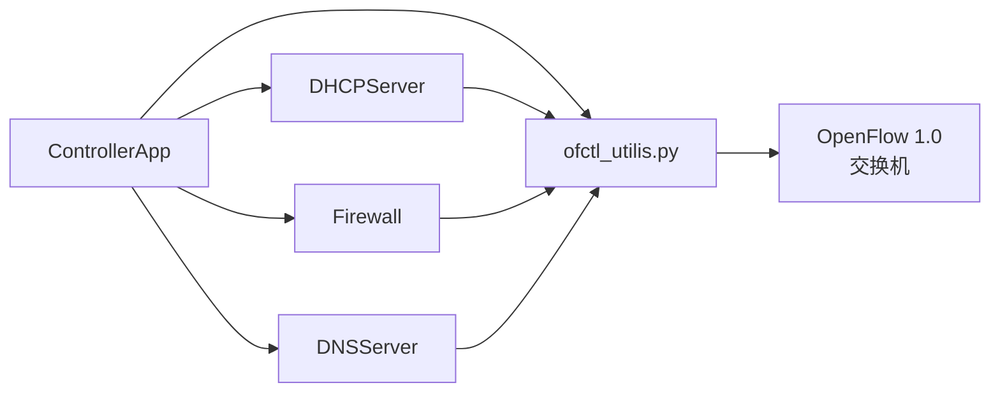

# API 参考

控制器包含四个主要模块：

| 模块 | 文件 | 说明 |
|------|------|------|
| `ControllerApp` | `controller.py` | 主 os-ken 应用，拓扑管理 + 转发逻辑 |
| `DHCPServer` | `dhcp.py` | DHCP 协议服务器 |
| `Firewall` | `firewall.py` | 基于规则的包过滤 |
| `DNSServer` | `dns_server.py` | 本地 DNS 解析 |

所有模块通过 `ofctl_utilis.py` 工具库与 OpenFlow 1.0 协议交互。

