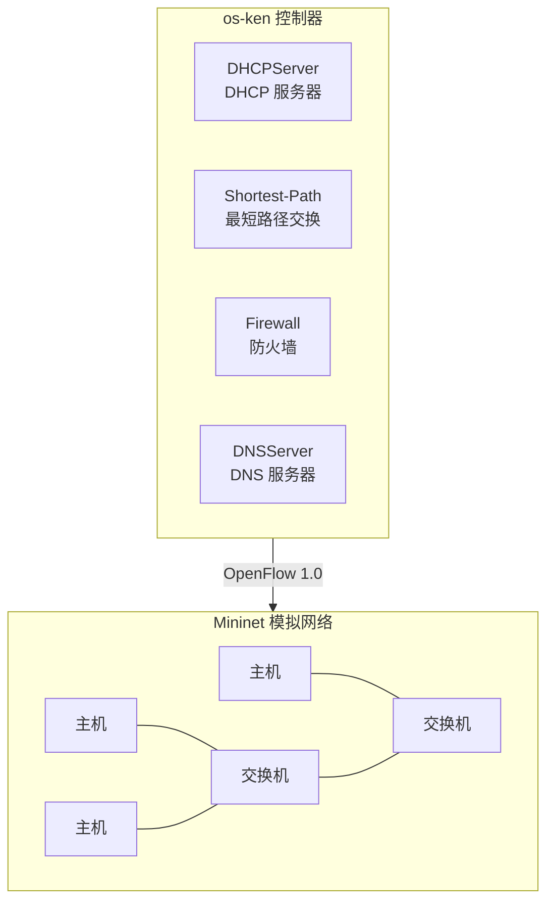
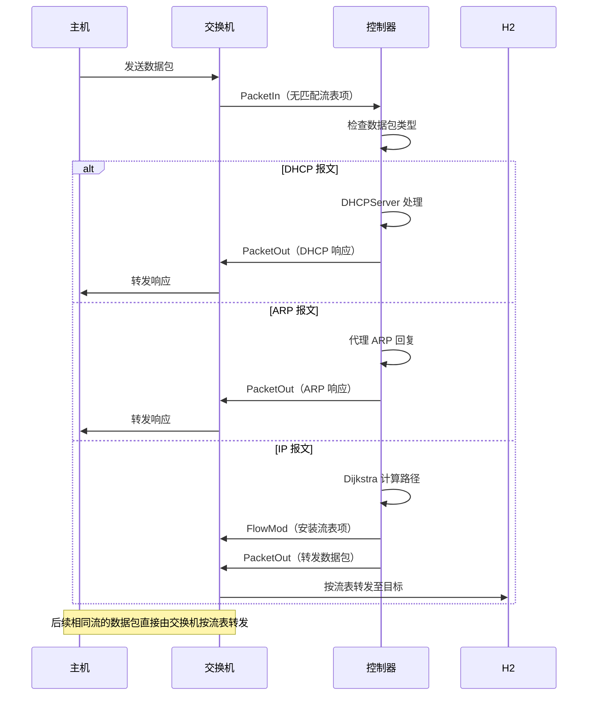

# 架构

## 系统概览

## 核心模块

### ControllerApp（`controller.py`）

主应用程序入口。订阅 OpenFlow 事件并协调各模块：

| 事件 | 处理函数 | 说明 |
|------|----------|------|
| `EventSwitchEnter` | `_handle_switch_add` | 记录交换机，安装 table-miss 流 + 防火墙规则 |
| `EventSwitchLeave` | `handle_switch_delete` | 清理拓扑图和 DPID 映射 |
| `EventHostAdd` | `handle_host_add` | 学习 MAC→位置 和 IP→MAC 映射 |
| `EventLinkAdd` | `handle_link_add` | 更新邻接图（双向） |
| `EventLinkDelete` | `handle_link_delete` | 从邻接图中移除链路 |
| `EventPacketIn` | `packet_in_handler` | 分派到 DHCP、DNS、ARP 代理或转发 |

### DHCPServer（`dhcp.py`）

完整的 DHCP 握手实现，支持租约管理。处理 DISCOVER→OFFER 和 REQUEST→ACK 流程。

详见 [API 参考](../api/dhcp.md)。

### Firewall（`firewall.py`）

从 `firewall_rule.json` 加载规则（或使用默认规则），转换为高优先级 OpenFlow 丢弃表项。
Cookie `0x305F`，优先级 `60000`。

### DNSServer（`dns_server.py`）

内置 DNS 解析器，将主机名（如 `h1.local`）映射为 IP 地址。通过 UDP 53 端口处理 DNS 查询/响应。

## 数据流

## 关键设计

### 拓扑图维护

控制器通过监听 `EventSwitchEnter`、`EventLinkAdd` 等事件实时维护 `self.graph` 邻接表，
格式为 `{dpid: {neighbor_dpid: local_port}}`，所有边权重为 1（跳数）。

### 流表优先级

| 优先级 | 用途 |
|--------|------|
| 60000 | 防火墙丢弃规则 |
| 1000 | 转发流表项 |
| 0 | Table-miss（发送至控制器） |
