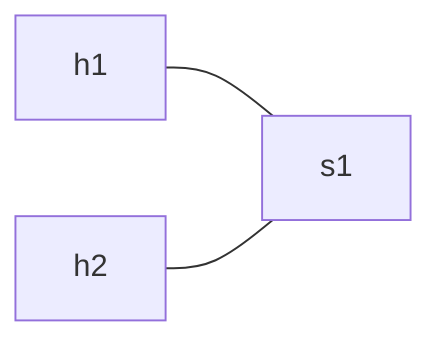
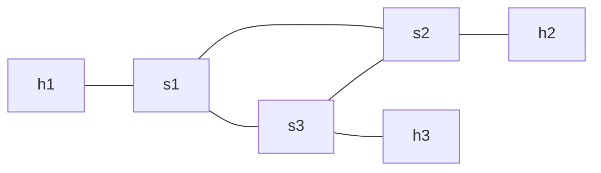
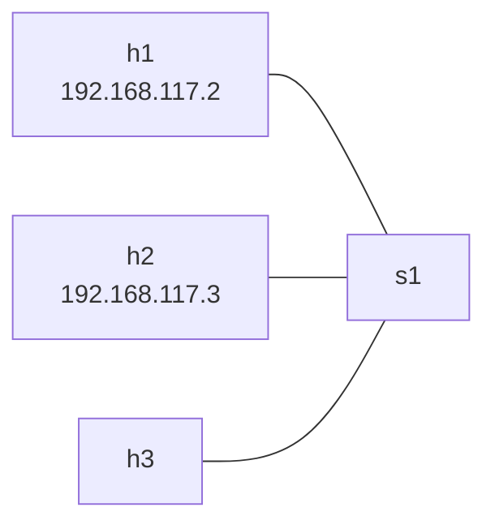

# 测试

## DHCP 测试

**拓扑**：1 个交换机，2 个主机



```bash
cd tests/dhcp_test/
sudo env "PATH=$PATH" python test_network.py
```

**预期**：主机获取 `192.168.1.2` ~ `192.168.1.99` 范围内的 IP 地址。

## 最短路径交换测试

**拓扑**：三角形（3 个交换机，3 个主机）



```bash
cd tests/switching_test/
sudo env "PATH=$PATH" python test_network.py
# 在 mininet CLI 中：
pingall
```

**预期**：无丢包，任意两台主机之间的路径不超过 2 个交换节点。

## 防火墙测试

**拓扑**：星型（1 个交换机，3 个主机，手动配置 IP `192.168.117.x/24`）



```bash
cd tests/firewall_test/
sudo env "PATH=$PATH" python test_network.py
```

| 测试项 | 预期结果 |
|--------|----------|
| h1 → h2 ICMP | 被阻止 |
| h1 → h3 ICMP | 允许 |
| h1 → h2 TCP/80 | 被阻止 |
| h1 → h2 TCP/8080 | 允许 |
