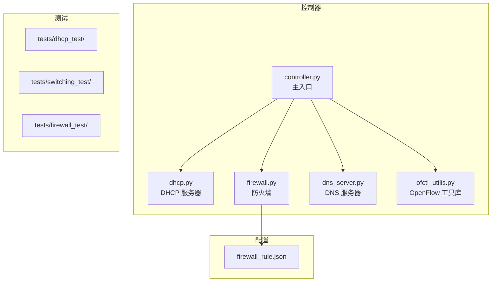

# CS305 SDN 控制器

CS305 计算机网络课程项目：基于 [os-ken](https://docs.openstack.org/os-ken/latest/)
构建的 **SDN 控制器**，通过 OpenFlow 1.0 协议管理
[Mininet](https://github.com/mininet/mininet) 模拟网络。

## 功能特性

| 功能 | 说明 |
|------|------|
| DHCP 服务器 | 自动 IP 地址分配，支持租约时长、Offer 超时和 Decline 超时 |
| 最短路径交换 | 拓扑感知的 Dijkstra 路由，代理 ARP，流表安装 |
| 防火墙 | 基于规则的高优先级 OpenFlow 丢弃规则 |
| DNS 服务器 | 内置本地主机名 DNS 解析 |

## 快速开始

```bash
# 终端 1 — 启动控制器
osken-manager --observe-links controller.py

# 终端 2 — 运行测试网络
cd tests/dhcp_test/
sudo env "PATH=$PATH" python test_network.py
```

## 项目结构



## 环境

- Python 3.8，使用 conda 环境 `cs305`
- `os-ken` SDN 框架
- `mininet` 网络模拟器
- OpenFlow 1.0 协议
