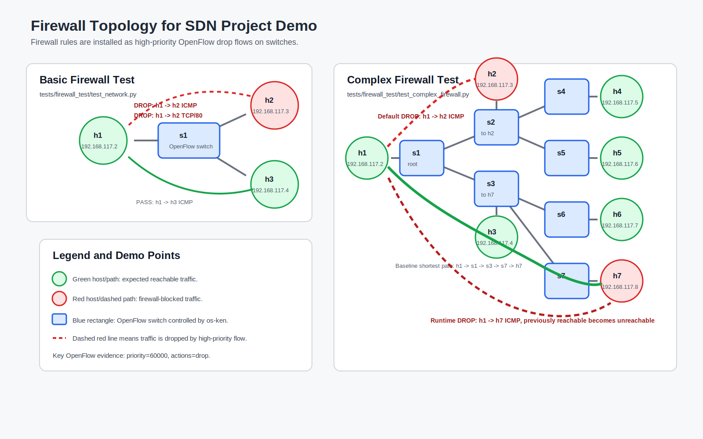
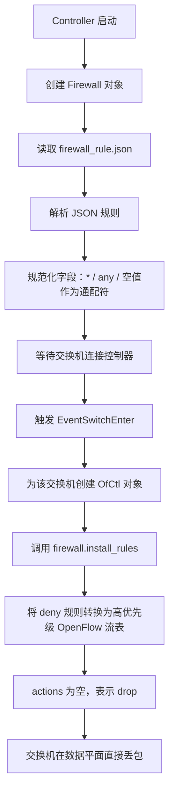
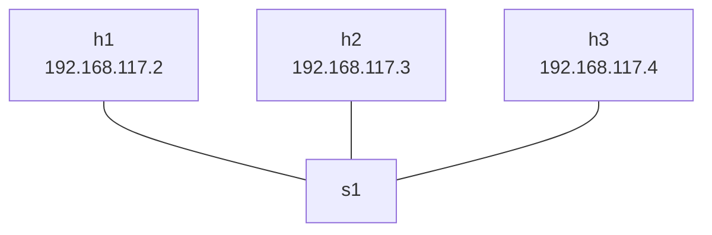
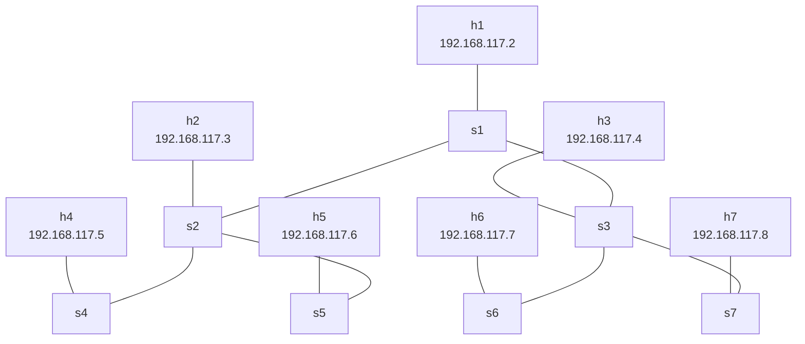
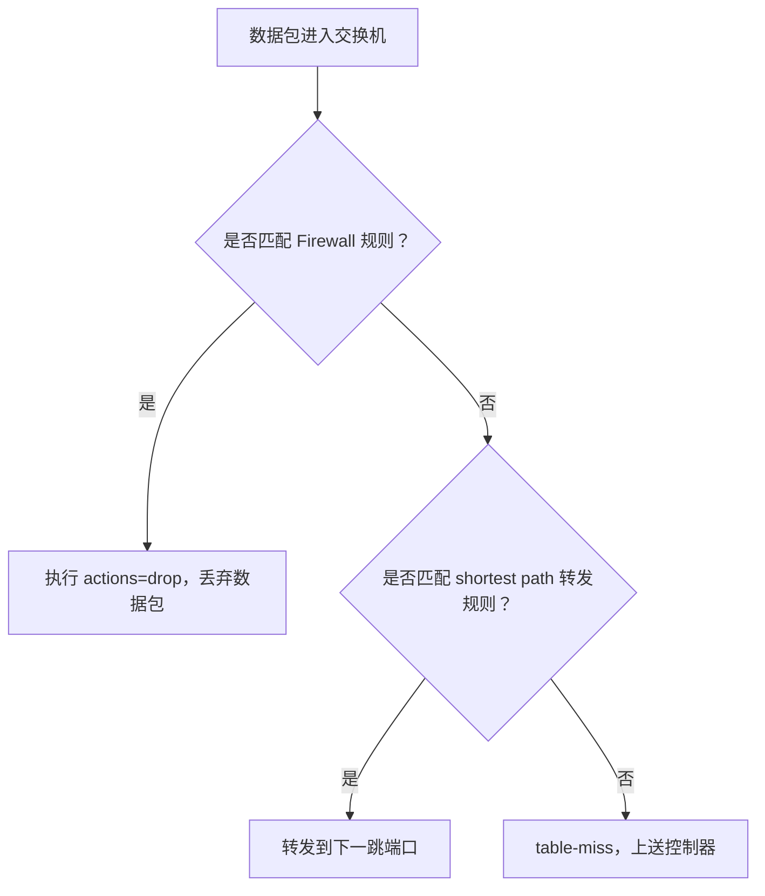

# Firewall 功能答辩报告

## 0. 答辩图示资源

本报告配套的 Figma 拓扑图已经创建完成，包含基础 Firewall 测试拓扑、复杂 Firewall 测试拓扑、阻断路径、可达路径和图例说明。

- Figma 文件：[CS305 Firewall Topology Diagrams](https://www.figma.com/design/dQHHij2QS5IlyXuPrTdqVF)
- 本地 SVG 备份：[firewall_topology_figma_import.svg](firewall_topology_figma_import.svg)

如果答辩现场网络不稳定，可以直接使用本地 SVG 文件。该 SVG 可以拖入 Figma、PPT 或浏览器中查看。



## 1. 功能概述

本项目的 Firewall 模块基于 SDN（Software Defined Networking，软件定义网络）和 OpenFlow 流表实现。传统网络中的防火墙通常部署在网关或主机上，而本项目利用 SDN 控制器的集中式管理能力，由控制器统一读取防火墙规则，并将规则下发到网络中的 OpenFlow 交换机。

运行时，交换机直接根据流表匹配数据包。如果某个数据包匹配防火墙规则，交换机会执行 `drop` 动作，将该数据包丢弃。这样，数据包不需要每次都上送到控制器处理，过滤逻辑直接发生在交换机的数据平面。

本项目的 Firewall 支持基于以下字段过滤 IP 数据包：

- 源 IP 地址：`src_ip`
- 目的 IP 地址：`dst_ip`
- 传输层协议：`proto`，支持 `icmp`、`tcp`、`udp`
- 源端口：`src_port`
- 目的端口：`dst_port`
- 动作：`action`，当前主要实现 `deny`

当前默认规则可以实现两个核心效果：

1. 阻断 `192.168.117.2` 到 `192.168.117.3` 的 ICMP 流量，也就是禁止 `h1 ping h2`。
2. 阻断 `192.168.117.2` 到 `192.168.117.3:80` 的 TCP 流量，也就是禁止 `h1` 访问 `h2` 的 HTTP 80 端口。

## 2. 核心实现思路

### 2.1 FirewallRule：规则的数据结构

`firewall.py` 中使用 `FirewallRule` 表示一条防火墙规则：

```python
@dataclass(frozen=True)
class FirewallRule:
    src_ip: str = None
    dst_ip: str = None
    proto: str = None
    src_port: object = None
    dst_port: object = None
    action: str = "deny"
```

可以把一条规则理解成一句话：

> 如果一个数据包的源 IP、目的 IP、协议、端口满足这些条件，就执行对应动作。

例如：

```json
{
  "src_ip": "192.168.117.2",
  "dst_ip": "192.168.117.3",
  "proto": "icmp",
  "src_port": "*",
  "dst_port": "*",
  "action": "deny"
}
```

这条规则表示：

> 如果数据包从 `192.168.117.2` 发往 `192.168.117.3`，并且协议是 ICMP，就丢弃。

其中 `*` 表示通配符，即任意端口都匹配。

### 2.2 规则文件：firewall_rule.json

项目中的防火墙规则写在 `firewall_rule.json` 中：

```json
{
  "rules": [
    {
      "src_ip": "192.168.117.2",
      "dst_ip": "192.168.117.3",
      "proto": "icmp",
      "src_port": "*",
      "dst_port": "*",
      "action": "deny"
    },
    {
      "src_ip": "192.168.117.2",
      "dst_ip": "192.168.117.3",
      "proto": "tcp",
      "src_port": "*",
      "dst_port": 80,
      "action": "deny"
    }
  ]
}
```

这两条规则分别用于：

- 阻断 `h1 -> h2` 的 ICMP 流量。
- 阻断 `h1 -> h2` 的 TCP 80 端口流量。

### 2.3 规则加载与规范化

控制器启动时会创建 Firewall 对象：

```python
self.firewall = Firewall()
```

`Firewall` 初始化时会调用 `_load_rules()` 读取规则文件：

```python
def __init__(self, rule_file="firewall_rules.json"):
    self.rule_file = rule_file
    self.rules = self._load_rules(rule_file)
    self.installed = set()
```

实现中默认查找 `firewall_rules.json`，如果不存在，则回退到 `firewall_rule.json`：

```python
if not os.path.exists(path) and rule_file == "firewall_rules.json":
    fallback = "firewall_rule.json"
    if os.path.exists(fallback):
        path = fallback
```

加载规则时，代码还会做规范化处理：

```python
def _normalize_any(self, value):
    if value is None:
        return None
    if isinstance(value, str) and value.strip().lower() in ["", "*", "any"]:
        return None
    return value
```

这意味着 `None`、空字符串、`*`、`any` 都会被视为通配符。

协议字段也会被转换：

```python
PROTO_MAP = {
    None: 0,
    "": 0,
    "*": 0,
    "any": 0,
    "icmp": inet.IPPROTO_ICMP,
    "tcp": inet.IPPROTO_TCP,
    "udp": inet.IPPROTO_UDP,
}
```

也就是说：

- `icmp` 会转换成 IP 协议号 `1`。
- `tcp` 会转换成 IP 协议号 `6`。
- `udp` 会转换成 IP 协议号 `17`。
- 通配协议会转换成 `0`。

### 2.4 规则安装时机

当交换机接入控制器时，`controller.py` 会触发 `EventSwitchEnter` 事件：

```python
@set_ev_cls(event.EventSwitchEnter)
def _handle_switch_add(self, ev):
    dp = ev.switch.dp
    dpid = dp.id

    self.dpid_to_dp[dpid] = dp

    if dpid not in self.graph:
        self.graph[dpid] = {}

    ofctl = OfCtl.factory(dp, self.logger)
    ofctl.set_packetin_flow(cookie=0, priority=0)
    self.firewall.reset_switch(dpid)
    self.firewall.install_rules({dpid: ofctl})
```

这里有两个关键动作：

1. `reset_switch(dpid)`：清除该交换机之前缓存的安装记录，防止交换机重连后规则不被重新安装。
2. `install_rules({dpid: ofctl})`：将防火墙规则安装到当前接入的交换机上。

因此，只要交换机连接到控制器，就会自动收到防火墙流表。

### 2.5 deny 规则如何变成 drop 流表

`install_rules()` 会遍历所有规则，只处理 `action == "deny"` 的规则：

```python
for rule in self.rules:
    if rule.action != "deny":
        continue
```

然后将规则转换成 OpenFlow 流表项：

```python
ofctl.set_flow(
    cookie=self.COOKIE,
    priority=self.PRIORITY,
    dl_type=ether.ETH_TYPE_IP,
    nw_src=rule.src_ip or 0,
    nw_dst=rule.dst_ip or 0,
    nw_proto=proto_num,
    tp_src=src_port,
    tp_dst=dst_port,
    actions=[],
)
```

这里最重要的是：

```python
actions=[]
```

在 OpenFlow 中，如果一条流表匹配成功，但动作列表为空，就表示丢弃该数据包。因此，本项目通过“高优先级匹配 + 空动作列表”的方式实现 `drop`。

### 2.6 为什么 Firewall 优先于普通转发

Firewall 流表的优先级是：

```python
PRIORITY = 60000
```

普通最短路径转发规则的优先级是：

```python
FORWARDING_PRIORITY = 1000
```

OpenFlow 会优先匹配高优先级流表。因此，当一个数据包既符合转发规则，又符合防火墙规则时，会先匹配防火墙规则，并被直接丢弃。

这可以保证 Firewall 的阻断效果不会被普通 shortest path forwarding 覆盖。

## 3. Firewall 处理流程



## 4. 基础测试脚本：tests/firewall_test/test_network.py

### 4.1 测试目标

基础测试脚本用于验证 Firewall 能否在简单拓扑中正确过滤指定流量，同时保证未被规则匹配的流量仍然可以正常通信。

它主要验证 4 件事：

1. `h1 -> h2` 的 ICMP 被阻断。
2. `h1 -> h3` 的 ICMP 可以通过。
3. `h1 -> h2:80` 的 TCP 连接被阻断。
4. `h1 -> h2:8080` 的 TCP 连接可以通过。

这可以证明 Firewall 不是简单地让整个网络断开，而是按照 IP、协议和端口精确过滤。

### 4.2 基础拓扑

测试脚本创建 3 台主机和 1 台交换机：

```python
h1 = self.addHost('h1', ip='192.168.117.2/24')
h2 = self.addHost('h2', ip='192.168.117.3/24')
h3 = self.addHost('h3', ip='192.168.117.4/24')

s1 = self.addSwitch('s1')

self.addLink(h1, s1)
self.addLink(h2, s1)
self.addLink(h3, s1)
```

拓扑图如下：

> Figma 中对应左侧图：「Basic Firewall Test」。



### 4.3 测试步骤

脚本启动 Mininet 网络：

```python
net = Mininet(
    topo=topo,
    autoSetMacs=True,
    controller=RemoteController
)
```

然后启动网络：

```python
net.start()
```

接着取出 3 台主机和交换机：

```python
h1 = net.get('h1')
h2 = net.get('h2')
h3 = net.get('h3')
s1 = net.get('s1')
```

为了让主机和控制器学习地址信息，脚本会发送 ARP：

```python
for _ in range(3):
    do_arp_all(net)
    time.sleep(1)
```

然后在 `h2` 上启动两个 HTTP 服务：

```python
h2.cmd('python3 -m http.server 80 --bind 192.168.117.3 >/tmp/h2-http80.log 2>&1 &')
h2.cmd('python3 -m http.server 8080 --bind 192.168.117.3 >/tmp/h2-http8080.log 2>&1 &')
```

这样可以分别测试 TCP 80 和 TCP 8080。

### 4.4 测试 1：h1 ping h2 应该失败

脚本执行：

```python
print(h1.cmd('ping -c 2 -W 1 192.168.117.3'))
```

根据规则：

```json
{
  "src_ip": "192.168.117.2",
  "dst_ip": "192.168.117.3",
  "proto": "icmp",
  "action": "deny"
}
```

`h1` 到 `h2` 的 ICMP 数据包会匹配 Firewall drop 流表，因此 ping 失败。

答辩时可以解释：

> 这里失败不是因为拓扑不连通，而是因为 `h1 -> h2` 的 ICMP 流量被高优先级防火墙流表丢弃。

### 4.5 测试 2：h1 ping h3 应该成功

脚本执行：

```python
print(h1.cmd('ping -c 2 -W 1 192.168.117.4'))
```

Firewall 规则只阻断 `192.168.117.2 -> 192.168.117.3`，并没有阻断 `192.168.117.2 -> 192.168.117.4`。

因此 `h1 ping h3` 应该成功。

这个测试说明：

> 网络本身是通的，控制器的 shortest path forwarding 也正常工作。只有被 Firewall 规则匹配的流量才会被阻断。

### 4.6 测试 3：h1 访问 h2:80 应该失败

脚本执行：

```python
print(curl(h1, 'http://192.168.117.3:80/'))
```

对应规则是：

```json
{
  "src_ip": "192.168.117.2",
  "dst_ip": "192.168.117.3",
  "proto": "tcp",
  "dst_port": 80,
  "action": "deny"
}
```

因此 `h1` 访问 `h2` 的 TCP 80 端口会失败。

### 4.7 测试 4：h1 访问 h2:8080 应该成功

脚本执行：

```python
print(curl(h1, 'http://192.168.117.3:8080/'))
```

虽然目的主机仍然是 `h2`，但目标端口是 `8080`，不匹配 `dst_port = 80` 的规则。

因此 `h1` 访问 `h2:8080` 应该成功。

这个测试证明：

> Firewall 支持按端口进行精确过滤，不是简单屏蔽两台主机之间的所有 TCP 流量。

### 4.8 基础测试的预期结果

| 测试 | 流量 | 预期结果 | 原因 |
| --- | --- | --- | --- |
| Test 1 | `h1 -> h2` ICMP | 失败 | 命中 ICMP deny 规则 |
| Test 2 | `h1 -> h3` ICMP | 成功 | 不匹配任何 deny 规则 |
| Test 3 | `h1 -> h2:80` TCP | 失败 | 命中 TCP 80 deny 规则 |
| Test 4 | `h1 -> h2:8080` TCP | 成功 | 端口 8080 不匹配 TCP 80 规则 |

### 4.9 答辩时可展示的交换机流表

进入 Mininet CLI 后，可以运行：

```bash
sh ovs-ofctl -O OpenFlow10 dump-flows s1
```

应能看到类似流表：

```text
priority=60000,icmp,nw_src=192.168.117.2,nw_dst=192.168.117.3,actions=drop
priority=60000,tcp,nw_src=192.168.117.2,nw_dst=192.168.117.3,tp_dst=80,actions=drop
```

这里的关键点是：

- `priority=60000`：Firewall 规则优先级很高。
- `icmp` / `tcp`：匹配具体协议。
- `nw_src` / `nw_dst`：匹配源 IP 和目的 IP。
- `tp_dst=80`：匹配 TCP 目的端口 80。
- `actions=drop`：匹配后直接丢弃。

## 5. 复杂测试脚本：tests/firewall_test/test_complex_firewall.py

### 5.1 测试目标

复杂测试脚本复用了 shortest path switching 的复杂拓扑，并额外加入 Firewall 验证。它用于满足项目要求：

> Reuse the complex test case of shortest path switching. Add firewall rules on the switches and observe whether the shortest paths in the entire network topology are correctly updated. The test case should cover the scenario: The firewall makes two hosts that were previously reachable become unreachable.

这个脚本主要验证：

1. 复杂拓扑中，正常情况下主机之间可以通过 shortest path 转发。
2. 默认 Firewall 规则能够阻断 `h1 -> h2` 的 ICMP。
3. 动态添加 runtime Firewall 规则后，原本可达的 `h1 -> h7` 会变成不可达。
4. 清除 runtime Firewall 规则后，`h1 -> h7` 可以恢复可达。
5. 交换机重启后，Firewall 规则会被控制器重新安装。

### 5.2 复杂拓扑结构

脚本定义了 7 台主机和 7 台交换机：

```python
for i in range(1, 8):
    host_name = "h%s" % i
    switch_name = "s%s" % i
    hosts[host_name] = self.addHost(host_name, ip="no ip defined/8")
    switches[switch_name] = self.addSwitch(switch_name)
    self.addLink(hosts[host_name], switches[switch_name])
```

每台主机连接到对应编号的交换机：

```text
h1 - s1
h2 - s2
h3 - s3
h4 - s4
h5 - s5
h6 - s6
h7 - s7
```

交换机之间的链路为：

```python
SWITCH_LINKS = [
    ("s1", "s2"),
    ("s1", "s3"),
    ("s2", "s4"),
    ("s2", "s5"),
    ("s3", "s6"),
    ("s3", "s7"),
]
```

完整拓扑如下：

> Figma 中对应右侧图：「Complex Firewall Test」。



从 `h1` 到 `h7` 的路径是：

```text
h1 -> s1 -> s3 -> s7 -> h7
```

从 `h1` 到 `h2` 的路径是：

```text
h1 -> s1 -> s2 -> h2
```

### 5.3 主机 IP 配置

脚本中定义了主机 IP：

```python
HOST_IPS = {
    "h1": "192.168.117.2",
    "h2": "192.168.117.3",
    "h3": "192.168.117.4",
    "h4": "192.168.117.5",
    "h5": "192.168.117.6",
    "h6": "192.168.117.7",
    "h7": "192.168.117.8",
}
```

虽然创建主机时使用的是：

```python
ip="no ip defined/8"
```

但后续会通过 `configure_host_ips(net)` 手动配置 IP：

```python
for host_name, ip in HOST_IPS.items():
    host = net.get(host_name)
    host.cmd("ifconfig %s-eth0 %s/24 up" % (host_name, ip))
```

这样做符合项目说明中的要求：复杂测试拓扑可以先创建无 IP 主机，再由脚本配置地址。

### 5.4 测试步骤 1：验证 h1 到 h7 原本可达

脚本首先运行：

```python
wait_for_ping(net, h1, h7_ip, True,
              "baseline h1 -> h7 before runtime firewall rule")
```

这里预期 `h1` 可以 ping 通 `h7`。

这一步的意义是建立 baseline：

> 在没有额外 runtime firewall 规则时，`h1 -> h7` 是可以通过 shortest path 正常通信的。

对应路径是：

```text
h1 -> s1 -> s3 -> s7 -> h7
```

### 5.5 测试步骤 2：验证默认规则阻断 h1 到 h2

脚本执行：

```python
assert_ping(h1, h2_ip, False,
            "default firewall h1 -> h2 ICMP deny rule")
```

这里预期 `h1` ping `h2` 失败。

原因是默认 `firewall_rule.json` 中有 ICMP deny 规则：

```json
{
  "src_ip": "192.168.117.2",
  "dst_ip": "192.168.117.3",
  "proto": "icmp",
  "action": "deny"
}
```

虽然 shortest path 可以计算出 `h1 -> s1 -> s2 -> h2`，但数据包在交换机上会先匹配高优先级 Firewall drop 规则，因此无法到达 `h2`。

这说明：

> Firewall 并不是改变拓扑本身，而是在已有拓扑和转发路径之上，用更高优先级的 drop 流表阻止特定流量通过。

### 5.6 测试步骤 3：动态添加 runtime Firewall 规则

脚本中定义了一个函数：

```python
def install_runtime_icmp_drop(net, src_ip, dst_ip):
    flow = (
        "cookie=%s,priority=61000,icmp,nw_src=%s,nw_dst=%s,actions=drop" %
        (RUNTIME_FIREWALL_COOKIE, src_ip, dst_ip)
    )
    for switch in net.switches:
        switch.cmd("ovs-ofctl -O OpenFlow10 add-flow %s '%s'" %
                   (switch.name, flow))
```

它会给所有交换机动态添加一条 OpenFlow drop 规则：

```text
priority=61000,icmp,nw_src=192.168.117.2,nw_dst=192.168.117.8,actions=drop
```

也就是：

> 阻断 `h1 -> h7` 的 ICMP 流量。

注意这里的优先级是 `61000`，比默认 Firewall 的 `60000` 还高，也远高于普通转发规则的 `1000`。

脚本调用：

```python
install_runtime_icmp_drop(net, HOST_IPS["h1"], h7_ip)
```

### 5.7 测试步骤 4：验证 h1 到 h7 从可达变为不可达

添加 runtime Firewall 规则后，脚本执行：

```python
assert_ping(h1, h7_ip, False,
            "runtime firewall makes prior h1 -> h7 path unreachable")
```

此时 `h1 -> h7` 的物理路径仍然存在：

```text
h1 -> s1 -> s3 -> s7 -> h7
```

但因为交换机上已经有高优先级 drop 规则：

```text
icmp,nw_src=192.168.117.2,nw_dst=192.168.117.8,actions=drop
```

所以 ICMP 数据包会被直接丢弃，ping 失败。

这一步正好满足项目要求中的关键场景：

> Firewall makes two hosts that were previously reachable become unreachable.

### 5.8 测试步骤 5：清除 runtime Firewall 规则并恢复可达

脚本定义了清除规则的函数：

```python
def clear_runtime_firewall(net, src_ip=HOST_IPS["h1"], dst_ip=HOST_IPS["h7"]):
    for switch in net.switches:
        switch.cmd("ovs-ofctl -O OpenFlow10 del-flows %s "
                   "'icmp,nw_src=%s,nw_dst=%s'" %
                   (switch.name, src_ip, dst_ip))
```

然后执行：

```python
clear_runtime_firewall(net)
wait_for_ping(net, h1, h7_ip, True,
              "h1 -> h7 after clearing runtime firewall rule")
```

预期 `h1 -> h7` 再次恢复可达。

这说明：

> `h1 -> h7` 的失败确实是由 Firewall drop 规则造成的，而不是拓扑断开、主机配置错误或 shortest path 算法错误。

### 5.9 测试步骤 6：验证交换机重启后规则重新安装

脚本还会重启 `s5`：

```python
restart_switch(net, "s5")
```

重启后会检查 `s5` 上是否仍然有 Firewall 流表：

```python
assert_firewall_flows_installed(net.get("s5"))
```

检查逻辑会查找：

```text
priority=60000
icmp
nw_src=192.168.117.2
nw_dst=192.168.117.3
actions=drop
```

这验证了：

> 当交换机重新连接控制器时，`EventSwitchEnter` 会再次触发，控制器会重新安装 Firewall 规则。

## 6. Firewall 与 shortest path switching 的关系

Shortest path switching 负责回答：

> 如果一个包应该被转发，它应该走哪条路径？

Firewall 负责回答：

> 这个包是否允许被转发？

因此二者关系是：

1. Firewall 规则优先级更高。
2. 如果包命中 Firewall drop 规则，直接丢弃。
3. 如果包没有命中 Firewall 规则，才继续匹配普通转发规则。
4. 普通转发规则根据 shortest path 的结果，把包转发到正确端口。

可以用下面的流程表示：



需要注意的是，Firewall 不会真的删除网络链路，也不会改变物理拓扑图。它通过高优先级 drop 流表，让特定通信在逻辑上不可达。因此答辩时可以这样解释：

> 从拓扑角度看，`h1` 到 `h7` 的路径仍然存在；从通信结果看，因为 Firewall 阻断了 ICMP 包，所以 `h1` 无法 ping 通 `h7`。这就是 Firewall 让原本可达的两个主机变为不可达。

## 7. 答辩演示步骤

### 7.1 启动控制器

先在一个终端运行：

```bash
osken-manager --observe-links controller.py
```

说明：

> 控制器启动后会初始化拓扑模块和 Firewall 模块。每当交换机连接控制器时，控制器会向交换机下发 table-miss 流表和 Firewall drop 流表。

### 7.2 演示基础 Firewall

在另一个终端运行：

```bash
sudo env "PATH=$PATH" python tests/firewall_test/test_network.py
```

观察输出：

1. `h1 ping h2` 失败。
2. `h1 ping h3` 成功。
3. `h1 curl h2:80` 失败。
4. `h1 curl h2:8080` 成功。

进入 Mininet CLI 后可以运行：

```bash
sh ovs-ofctl -O OpenFlow10 dump-flows s1
```

向老师展示：

```text
priority=60000,...,actions=drop
```

重点说明：

> Firewall 规则已经被下发到交换机，交换机直接根据 OpenFlow 流表丢弃匹配的数据包。

### 7.3 演示复杂拓扑 Firewall

运行：

```bash
sudo env "PATH=$PATH" python tests/firewall_test/test_complex_firewall.py
```

脚本会依次展示：

1. `h1 -> h7` 初始可达。
2. 默认 Firewall 阻断 `h1 -> h2`。
3. 动态安装 runtime Firewall 规则。
4. `h1 -> h7` 从可达变为不可达。
5. 清除 runtime Firewall 规则。
6. `h1 -> h7` 恢复可达。
7. 重启交换机后 Firewall 规则仍会重新安装。

答辩时重点讲：

> 这个测试复用了复杂 shortest path 拓扑。`h1 -> h7` 的路径本来存在，并且可以 ping 通。随后我们给所有交换机添加高优先级 ICMP drop 规则，阻断 `192.168.117.2 -> 192.168.117.8`。此时物理拓扑没有变化，但通信结果从可达变为不可达，说明 Firewall 生效。

## 8. 可以直接使用的答辩讲稿

本项目的 Firewall 是基于 SDN 和 OpenFlow 流表实现的。控制器启动时会读取 `firewall_rule.json` 中的规则，每当交换机连接控制器时，控制器会将这些规则转换成高优先级的 OpenFlow drop 流表下发到交换机。

在实现上，规则使用 `FirewallRule` 表示，包含源 IP、目的 IP、协议、源端口、目的端口和动作等字段。规则文件中的 `*` 或 `any` 会被当作通配符处理，`icmp`、`tcp`、`udp` 会被转换成对应的 IP 协议号。

真正实现丢包的是 `install_rules()` 函数。它只处理 `deny` 规则，并调用 `ofctl.set_flow()` 安装流表。流表的 `priority` 是 `60000`，高于普通最短路径转发规则的 `1000`。同时，流表的 `actions` 设置为空列表，所以匹配到这条规则的数据包会被交换机直接丢弃。

基础测试中，我们构造了 3 台主机和 1 台交换机的拓扑。`h1` 的 IP 是 `192.168.117.2`，`h2` 的 IP 是 `192.168.117.3`，`h3` 的 IP 是 `192.168.117.4`。测试结果中，`h1 ping h2` 失败，说明 ICMP deny 规则生效；`h1 ping h3` 成功，说明网络本身正常；`h1` 访问 `h2:80` 失败，而访问 `h2:8080` 成功，说明 Firewall 可以按 TCP 端口进行精确过滤。

复杂测试中，我们构造了 7 台主机和 7 台交换机的拓扑。每台主机连接到对应编号的交换机，交换机之间形成一棵多跳拓扑。测试首先证明 `h1 -> h7` 原本可以通过 shortest path 正常通信，路径是 `h1 -> s1 -> s3 -> s7 -> h7`。随后脚本动态向所有交换机添加一条高优先级 ICMP drop 规则，阻断 `192.168.117.2 -> 192.168.117.8`。添加规则后，`h1 ping h7` 从成功变成失败，说明 Firewall 可以让原本可达的两个主机变为不可达。最后清除 runtime Firewall 规则后，`h1 -> h7` 又恢复可达，进一步证明不可达是由 Firewall 规则造成的。

因此，本项目的 Firewall 实现了集中式规则管理和分布式交换机执行：控制器负责读取和下发规则，交换机负责在数据平面高速过滤数据包。

## 9. 总结

本项目 Firewall 的核心特点如下：

- 使用 JSON 文件描述防火墙规则，规则清晰、易修改。
- 支持按源 IP、目的 IP、协议和端口过滤。
- 使用 OpenFlow 高优先级 drop 流表实现阻断。
- 防火墙规则优先级高于普通 shortest path 转发规则。
- 交换机接入或重连控制器时，会自动安装 Firewall 规则。
- 基础测试验证了 ICMP 和 TCP 端口过滤。
- 复杂测试验证了 Firewall 能让原本可达的主机变为不可达，并且规则清除后通信可以恢复。

从网络初学者角度理解，可以把这个 Firewall 看成交换机里的“禁止通行规则”。控制器负责把规则贴到每台交换机上，交换机看到符合规则的数据包，就直接丢弃；不符合规则的数据包，才继续按照最短路径进行转发。
