# CS305 2026Spring Project: SDN-based Network Management System
## Introduction
In this project, we developed a Software-Defined Networking (SDN) based network management system. It mainly achieves the following basic functionalities:
1. **DHCP Management**: The system can manage DHCP services, allowing administrators to configure and monitor IP address allocation.
2. **Shortest Path Routing**: The system provides intelligent routing capabilities, ensuring efficient data transmission across the network.
3. **Firewall Management**: The system provides firewall management capabilities, allowing administrators to configure and monitor network security policies.

Also, we implemented some bonus features, such as:
1. **DHCP Lease Duration & RFC-Inspired Behaviors**: NAK, RELEASE, DECLINE handling, and lease expiration/reclamation.
2. **DNS UDP/53 Record Resolution**: A, AAAA, CNAME RR are implemented for static name resolution with NXDOMAIN for unknown names.
3. **NAT Gateway**: ICMP SNAT/DNAT with NAT table management and proxy ARP for external hosts.
4. **Mininet Network Experiments**: TCP congestion control algorithm comparison (Reno vs Cubic) and bufferbloat phenomenon verification.

## System Architecture

The project is built around one os-ken controller application. Mininet creates hosts, Open vSwitch switches, and links, while the controller observes topology events, handles Packet-In messages, and installs OpenFlow rules.

```text
Mininet hosts
    |
    | Ethernet / ARP / IPv4 / UDP / ICMP / DHCP / DNS packets
    v
Open vSwitch datapaths
    |
    | OpenFlow 1.0 Packet-In, FlowMod, PacketOut, topology events
    v
controller.py
    |
    +-- Topology manager: switch/link/host learning, port events
    +-- Shortest-path switching: Dijkstra by default, Bellman-Ford variant
    +-- ARP proxy: host learning and local ARP replies
    +-- DHCPServer: address allocation and lease management
    +-- DNSServer: UDP/53 static A/AAAA/CNAME responses
    +-- Firewall: high-priority deny flow installation
    +-- NATServer: ICMP SNAT/DNAT bonus support
    |
    v
OpenFlow rules and PacketOut responses sent back to switches
```


The main source files are organized as follows:

```text
.
|-- controller.py              Main os-ken controller and Packet-In dispatcher
|-- controller_bf.py           Bellman-Ford controller entry point
|-- dhcp.py                    DHCP server, lease state, OFFER/ACK/NAK/RELEASE/DECLINE
|-- dns_server.py              UDP/53 static DNS responder for A/AAAA/CNAME records
|-- firewall.py                Firewall rule parser and deny-flow installer
|-- firewall_rule.json         Default firewall policy used in tests
|-- nat.py                     ICMP NAT bonus module
|-- ofctl_utilis.py            OpenFlow helper wrappers for FlowMod and PacketOut
|-- tests/
|   |-- dhcp_test/             DHCP basic and bonus integration tests
|   |-- switching_test/        Shortest-path, complex topology, Bellman-Ford tests
|   |-- firewall_test/         Basic and complex firewall tests
|   |-- nat_test/              NAT manual and automated tests
|   |-- *_unit_test.py         Unit tests for firewall and routing algorithms
|-- experiments/               TCP congestion control and bufferbloat experiments
|-- requirements.txt           Python dependencies for the Mininet VM
|-- pyproject.toml             Project metadata
```

## DHCP Implementation

### 1. Design Goal

The DHCP module is responsible for assigning IP addresses to hosts that join the Mininet network without pre-configured IP addresses. In our implementation, the DHCP logic is mainly implemented in `dhcp.py`.

The DHCP module has three main goals:

1. assign a valid IP address from the configured address pool;
2. maintain the relationship between client MAC addresses and allocated IP addresses;
3. avoid duplicate IP allocation.

In addition to the basic DHCP process, we also implemented two bonus functions:

1. DHCP lease duration;
2. RFC-inspired IP allocation control, including REQUEST validation, NAK, RELEASE, and DECLINE handling.


### 2. DHCP Server State Design

The configurable DHCP parameters are defined in the `Config` class.

| Item | Value in our implementation |
|---|---|
| DHCP server IP | `192.168.1.1` |
| Address pool | `192.168.1.2` to `192.168.1.99` |
| Netmask | `255.255.255.0` |
| DNS server | `8.8.8.8` |
| Lease duration | `8 s` for demo |
| OFFER timeout | `4 s` for demo |
| DECLINE timeout | `6 s` for demo |

The short timeout values are used for demonstration. In normal use, these values can be changed to longer durations, such as `3600`, `60`, and `300` seconds.

To manage address allocation, the DHCP server maintains three kinds of states.

| State | Data structure | Purpose |
|---|---|---|
| Formal lease | `mac_to_ip`, `ip_to_mac`, `lease_expire_time` | Records IP addresses confirmed by DHCP ACK |
| Temporary OFFER | `offered_ip_by_mac`, `offered_mac_by_ip`, `offer_expire_time` | Reserves IP addresses after DHCP OFFER but before DHCP ACK |
| Declined IP | `declined_ip_until` | Temporarily blocks IP addresses declined by clients |

This state design separates temporary reservations from confirmed leases. Therefore, an IP address is not considered fully allocated after DISCOVER. It becomes a formal lease only after the server receives and accepts a DHCP REQUEST.

### 3. Basic DHCP DORA Process

Our DHCP module follows the simplified DORA workflow:

```text
DISCOVER -> OFFER -> REQUEST -> ACK
```

The main DHCP logic is implemented in `dhcp.py`. For each DHCP packet, `handle_dhcp()` cleans expired states, decodes the DHCP message type, and dispatches it to the corresponding handler.

| DHCP message | Function used | Behavior |
|---|---|---|
| DISCOVER | `_handle_discover()` | Select an available IP and send OFFER |
| REQUEST | `_handle_request()` | Validate the requested IP and send ACK or NAK |
| RELEASE | `_handle_release()` | Release an existing lease |
| DECLINE | `_handle_decline()` | Temporarily block a declined IP |

For DHCP DISCOVER, the server uses `_pick_offer_ip()` to choose an address and records it as a temporary OFFER. For DHCP REQUEST, the server uses `_validate_request_for_ack()` to check the requested IP. If the request is valid, `_commit_lease()` records the formal lease and the server sends ACK; otherwise, it sends NAK.

A normal DORA process can be observed from the controller log:

<p align="center">
  
</p>

<p align="center">
  <b>Figure 1. DHCP DORA process in the controller log</b>
</p>


### 4. IP Address Allocation Strategy and Duplicate Prevention

The server maintains three types of DHCP states:

| State | Data structure | Purpose |
|---|---|---|
| Formal lease | `mac_to_ip`, `ip_to_mac`, `lease_expire_time` | Records IP addresses confirmed by DHCP ACK |
| Temporary OFFER | `offered_ip_by_mac`, `offered_mac_by_ip`, `offer_expire_time` | Reserves IP addresses after DHCP OFFER but before DHCP ACK |
| Declined IP | `declined_ip_until` | Temporarily blocks IP addresses declined by clients |

**Bonus: duplicate IP allocation prevention.**  
To avoid duplicate allocation, the server checks IP availability in both the OFFER stage and the ACK stage.

#### 4.1 OFFER stage

When choosing an IP address, `_pick_offer_ip()` follows this priority:

1. If the client already has a valid lease, reuse the same IP.
2. If the client already has a valid OFFER, reuse the offered IP and extend its OFFER timeout.
3. Otherwise, scan the address pool and select the first available IP.

An IP address is available only when it is:

1. inside the configured address pool;
2. not leased to another MAC address;
3. not offered to another MAC address;
4. not temporarily blocked after DECLINE.

This check is implemented through `_is_ip_available_for_mac()`.

#### 4.2 ACK stage

Before sending ACK, the server validates the requested IP again. A REQUEST is accepted only when:

1. the requested IP is available;
2. the IP belongs to the same client or has no owner;
3. if the client has an active OFFER, the requested IP matches the offered IP.

If the validation fails, the server sends NAK instead of ACK.

#### 4.3 Two-stage guarantee

```text
OFFER stage:
    avoid offering the same IP to two clients

ACK stage:
    avoid confirming an invalid or occupied IP
```

After a valid REQUEST is accepted, `_commit_lease()` updates the formal lease state:

```text
mac_to_ip[client_mac] = assigned_ip
ip_to_mac[assigned_ip] = client_mac
lease_expire_time[assigned_ip] = current_time + lease_duration
```

At the same time, the temporary OFFER record is removed, keeping the lease table and offer table consistent.


### 5. DHCP Lease Duration

Each formal lease has an expiration time configured by `Config.lease_duration`.

The lease duration is implemented in two places:

1. When building DHCP OFFER and DHCP ACK packets, the server adds the lease time option:

```text
DHCP_IP_ADDR_LEASE_TIME_OPT = lease_duration
```

2. When committing a lease, the server records its expiration time in `lease_expire_time`.

Before processing each DHCP packet, `_cleanup_expired_state()` is called. If a lease has expired, it is removed from the lease tables, and the IP address becomes available again.


### 6. RFC-Inspired DHCP Behavior

Besides the basic DORA process, our implementation supports several RFC-inspired behaviors.

#### 6.1 Server identifier check

When processing DHCP REQUEST, `_handle_request()` checks the server identifier option. If the REQUEST targets another DHCP server, our server ignores it.

#### 6.2 DHCP NAK

If the requested IP is missing, outside the pool, declined, leased to another MAC, offered to another MAC, or inconsistent with the previous OFFER, `_validate_request_for_ack()` rejects it and `assemble_nak()` sends DHCP NAK.

#### 6.3 DHCP RELEASE

`_handle_release()` handles DHCP RELEASE. When a client releases its address, the server removes the corresponding records from `mac_to_ip`, `ip_to_mac`, and `lease_expire_time`.

#### 6.4 DHCP DECLINE

`_handle_decline()` handles DHCP DECLINE. When a client declines an offered IP, the server removes the temporary OFFER and stores the IP in `declined_ip_until`. During the decline timeout, this IP will not be offered again.

#### 6.5 Expired state cleanup

Before handling each DHCP packet, `_cleanup_expired_state()` cleans:

```text
expired leases
expired offers
expired declined IP records
```
### 7. Bonus Test Script

To verify the bonus DHCP functions, we designed an additional test script `test_dhcp_bonus.py`. This script focuses on the extended DHCP behaviors beyond the basic DORA process.


#### 7.1 Test Configuration

Before running the bonus test script, the following parameters in `dhcp.py` should be set to short demo values:

```python
lease_duration = 8
offer_timeout = 4
decline_timeout = 6
```

The controller and the bonus test script are started in two terminals.

**Terminal 1:**
```bash
cd /home/mininet/CS305-2026Spring-Project
osken-manager --observe-links controller.py
```

**Terminal 2:**
```bash
cd /home/mininet/CS305-2026Spring-Project/tests/dhcp_test
sudo env "PATH=$PATH" python test_dhcp_bonus.py
```

#### 7.2 Test Procedure

The bonus test script performs the following checks:

1. Start a Mininet topology with five hosts (`h1` to `h5`) and clear their initial IP addresses.
2. Verify that `h1` completes a normal DORA process and that the ACK contains the lease time option.
3. Verify that `h2` receives a different IP address from `h1`.
4. Verify that `h3` requests an occupied IP and receives DHCP NAK.
5. Verify that after `h2` sends DHCP RELEASE, the released IP can be reassigned to `h4`.
6. Verify that after `h3` sends DHCP DECLINE, the same IP is not immediately re-offered.
7. Wait for lease expiration and verify that the expired IP can be reassigned to `h5`.

#### 7.3 Test Result and Analysis

Figure 2 shows the controller log generated during the execution of the bonus test script.

<p align="center">
  
</p>

<p align="center">
  <b>Figure 2. Controller log of the DHCP bonus test script.</b>
</p>

From Figure 2, the following results can be observed:

1. **Normal DORA process**:  
   `h1` receives `192.168.1.2`, and `h2` receives `192.168.1.3`, showing that the DHCP server can complete the basic allocation process correctly.

2. **Duplicate IP prevention**:  
   When client `00:00:00:00:00:03` requests `192.168.1.2`, the server returns  
   `NAK -> ... requested IP 192.168.1.2 is already leased to 00:00:00:00:00:01`,  
   which shows that occupied addresses are not incorrectly reassigned.

3. **DHCP RELEASE**:  
   After client `00:00:00:00:00:02` releases `192.168.1.3`, the same address is later offered to and confirmed for client `00:00:00:00:00:04`.  
   This shows that released leases can be reused.

4. **DHCP DECLINE**:  
   Client `00:00:00:00:00:03` first receives OFFER `192.168.1.4`, then sends DECLINE.  
   The controller records  
   `DECLINE -> ... ip=192.168.1.4, blocked_until=...`,  
   and the next OFFER for this client becomes `192.168.1.5` instead of `192.168.1.4`.  
   This shows that declined IPs are temporarily quarantined.

5. **Lease expiration and reclamation**:  
   The controller later prints  
   `Lease expired -> client=00:00:00:00:00:01, ip=192.168.1.2`  
   and  
   `Lease expired -> client=00:00:00:00:00:04, ip=192.168.1.3`.  
   After that, client `00:00:00:00:00:05` is offered `192.168.1.2` and successfully ACKed.  
   This demonstrates that expired leases are correctly reclaimed and returned to the address pool.

6. **Temporary OFFER timeout and DECLINE timeout**:  
   The log also shows  
   `OFFER expired -> client=00:00:00:00:00:03, ip=192.168.1.5`  
   and  
   `DECLINE timeout released ip=192.168.1.4`,  
   indicating that the server correctly cleans expired temporary states.

## Shortest Path Switching Implementation

### 1. Design Goal

The shortest-path switching module is implemented in `controller.py`. It uses the global topology discovered by os-ken (`--observe-links`) to compute hop-minimal paths between switches and installs OpenFlow 1.0 forwarding rules on every switch along the path.

The module has four main responsibilities:

1. maintain a switch-level adjacency graph from `EventLinkAdd` / `EventLinkDelete`;
2. learn host locations (`MAC -> (dpid, port)`) from topology events and ARP/IP packets;
3. run Dijkstra (or Bellman-Ford) to compute shortest paths;
4. install per-destination-MAC flows and reply to ARP requests with proxy ARP when the target IP is known.

Forwarding rules match `dl_dst` and output to the next-hop port. Priority `1000` is lower than firewall drop rules (`60000`), so filtering is evaluated first.

### 2. Controller Workflow

When an IP packet reaches the controller:

1. learn the source host location if the packet arrives on a host-facing port;
2. look up the destination MAC in `mac_to_loc`;
3. install flows along the shortest path from the **source host’s attachment switch** to the destination switch;
4. send the current packet out from the **ingress switch** toward the destination.

To remain stable in topologies with loops, the controller also:

- ignores host learning on inter-switch ports after LLDP has marked them;
- scrubs poisoned host entries when links are (re)discovered;
- allows correction to the Mininet `autoSetMacs` mapping (`00:00:00:00:00:0N -> switch N`);
- floods IP packets whose destination MAC is not yet known instead of silently dropping repeats.

### 3. Basic Test (Triangle Topology)

The basic test `tests/switching_test/test_network.py` builds a triangle with three switches and three hosts. It verifies that the controller can forward traffic on a small cyclic topology and that `pingall` succeeds after gratuitous ARP.

| Host pair | Expected shortest path (switch hops) |
|---|---|
| `h1 -> h2` | `s1 -> s2` (1) |
| `h1 -> h3` | `s1 -> s3` (1) |
| `h2 -> h3` | `s2 -> s3` (1) |

**Run command:**

```bash
# Terminal 1
osken-manager --observe-links controller.py

# Terminal 2
cd tests/switching_test
sudo env "PATH=$PATH" python test_network.py
# Mininet CLI: pingall
```

<p align="center">
  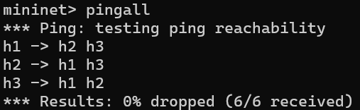
</p>

<p align="center">
  <b>Figure 3. Basic triangle-topology connectivity (`pingall`, 0% packet loss).</b>
</p>

### 4. Complex Test (8 Hosts, 8 Switches, Loops)

To satisfy the project requirement for a complex testcase (>6 hosts, >6 switches, >10 edges, loops, and dynamic topology changes), we implemented `tests/switching_test/test_complex_shortest_path.py`.

#### 4.1 Topology

The topology contains **8 hosts**, **8 switches**, **8 host–switch edges**, and **10 inter-switch edges** (18 edges in total).

| Link type | Edges |
|---|---|
| Host access | `h1-s1` … `h8-s8` (each host only attaches to its numbered switch) |
| Outer ring | `s1-s2`, `s2-s4`, `s4-s7`, `s7-s6`, `s6-s3`, `s3-s1` |
| Inner chords | `s2-s5`, `s5-s6`, `s6-s8`, `s8-s3` |

Hosts use addresses `192.168.10.1` – `192.168.10.8/24`. The topology figure is stored at `img/complex_shortest_path_topology.svg` (source: `tests/switching_test/complex_shortest_path_topology.svg`).

<p align="center">
  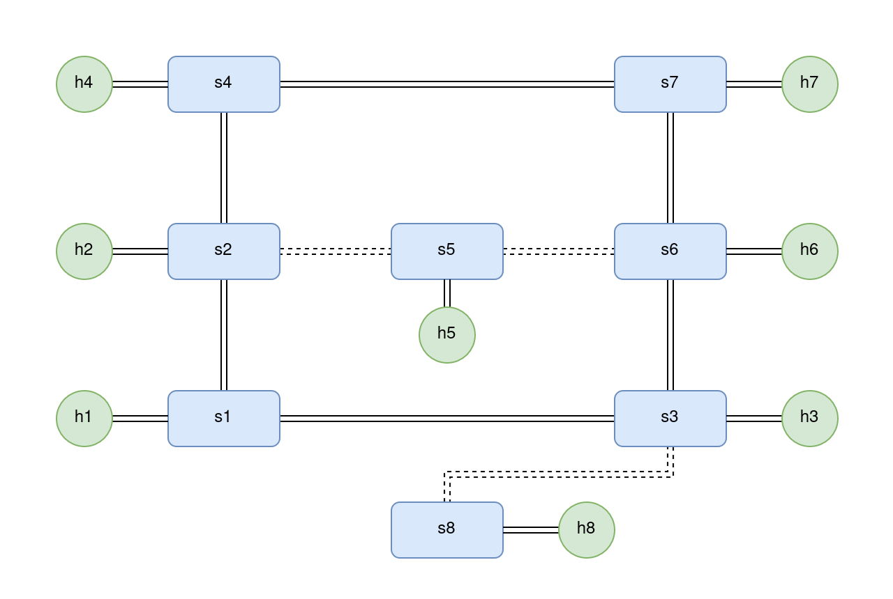
</p>

<p align="center">
  <b>Figure 4. Complex shortest-path test topology (8 hosts, 8 switches, 10 inter-switch links).</b>
</p>

#### 4.2 Expected Baseline Paths

The automated script prints expected paths before running pings. Baseline cases (from `h1`):

| Test case | Expected host path | Switch hops |
|---|---|---|
| `h1 -> h2` | `h1 -> s1 -> s2 -> h2` | 1 |
| `h1 -> h4` | `h1 -> s1 -> s2 -> s4 -> h4` | 2 |
| `h1 -> h7` | `h1 -> s1 -> s2 -> s4 -> s7 -> h7` | 3 |
| `h1 -> h8` | `h1 -> s1 -> s3 -> s8 -> h8` | 2 |

#### 4.3 Dynamic Topology Tests

After baseline connectivity, the script drives three types of changes required by the project demo:

| Step | Operation | Verification |
|---|---|---|
| Link down/up | `link s2 s4 down/up` | `h1 -> h7` uses alternate path `s1->s3->s6->s7` when `s2-s4` is down |
| Switch stop/start | `switch s5 stop/start` | `h2 -> h6` reroutes via `s2->s1->s3->s6` when `s5` is down |
| Port modify | `ovs-ofctl mod-port` on `s3` toward `s1` | `h1 -> h8` reroutes when direct `s1-s3` edge is disabled at `s3` |

Each step waits for controller reconvergence and compares ping results against the script’s BFS expectation.

#### 4.4 Test Procedure

**Terminal 1:**

```bash
cd ~/CS305-2026Spring-Project
osken-manager --observe-links controller.py
```

**Terminal 2:**

```bash
cd ~/CS305-2026Spring-Project/tests/switching_test
sudo env "PATH=$CONDA_BIN:$PATH" python test_complex_shortest_path.py
```

The script automatically:

1. waits for all switches to connect to the controller;
2. waits for LLDP link discovery;
3. installs static ARP tables and sends gratuitous ARP;
4. runs `pingAll`, then reinforces learning for `h4` and `h8`;
5. runs 4 baseline + 6 dynamic ping tests (10 cases total).

A helper script is also provided: `scripts/vm_run_complex_test.sh`.

#### 4.5 Test Result

All **10/10** automated cases passed in our Mininet VM (`cs305` environment), including baseline connectivity and recovery after link, switch, and port changes.

<p align="center">
  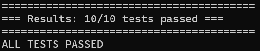
</p>

<p align="center">
  <b>Figure 5. Automated complex shortest-path test result (10/10 passed).</b>
</p>

## Firewall Implementation

### 1. Design Goal

The firewall module is responsible for filtering selected network traffic inside the SDN network. Instead of installing filtering logic on each host, the controller reads firewall rules and installs high-priority OpenFlow drop rules on the switches.

The firewall module has three main goals:

1. parse firewall rules from a JSON configuration file;
2. translate deny rules into OpenFlow flow entries;
3. make sure firewall rules remain effective after switch reconnection.

In our implementation, the firewall logic is mainly implemented in `firewall.py`, while `controller.py` calls the firewall module when a switch joins the controller.

### 2. Firewall Rule Design

Each firewall rule is represented by a `FirewallRule` object. A rule can specify source IP, destination IP, protocol, source port, destination port, and action.

| Field | Meaning |
|---|---|
| `src_ip` | Source IP address |
| `dst_ip` | Destination IP address |
| `proto` | Network protocol, such as `icmp`, `tcp`, or `udp` |
| `src_port` | Source transport-layer port |
| `dst_port` | Destination transport-layer port |
| `action` | Rule action. The project mainly uses `deny` |

The rule file is loaded from `firewall_rules.json`. If this file does not exist, the module falls back to `firewall_rule.json`, which is the rule file used in our project. If no rule file is found, the firewall uses default deny rules.

The default firewall rules block:

1. ICMP traffic from `192.168.117.2` to `192.168.117.3`;
2. TCP traffic from `192.168.117.2` to `192.168.117.3` with destination port `80`.

For wildcard fields, the firewall treats `None`, empty string, `*`, and `any` as match-any values. Protocol names are normalized into OpenFlow protocol numbers:

| Protocol | OpenFlow value |
|---|---|
| `icmp` | `1` |
| `tcp` | `6` |
| `udp` | `17` |

### 3. OpenFlow Rule Installation

When a switch joins the controller, `controller.py` creates an `OfCtl` object for the switch and calls:

```python
self.firewall.reset_switch(dpid)
self.firewall.install_rules({dpid: ofctl})
```

For each valid `deny` rule, the firewall installs a high-priority OpenFlow flow entry:

```text
priority = 60000
dl_type  = IPv4
nw_src   = rule source IP
nw_dst   = rule destination IP
nw_proto = ICMP / TCP / UDP
tp_src   = source port if specified
tp_dst   = destination port if specified
actions  = []
```

An empty action list means that the switch drops matched packets directly. This priority is higher than the normal forwarding priority (`1000`), so firewall rules are checked before shortest-path forwarding rules.

The firewall also keeps an `installed` set to avoid repeatedly installing the same rule on the same switch. However, a switch restart clears the switch flow table. To handle this case, `reset_switch(dpid)` removes cached installation records for that switch before reinstalling the rules. This ensures that after `switch stop/start`, the firewall drop flows are installed again.

### 4. Basic Firewall Test

The basic firewall test is implemented in `tests/firewall_test/test_network.py`. It builds a simple topology with three hosts and one switch:

```text
h1 ---\
h2 ---- s1
h3 ---/
```

The hosts use manually configured IP addresses:

| Host | IP address |
|---|---|
| `h1` | `192.168.117.2` |
| `h2` | `192.168.117.3` |
| `h3` | `192.168.117.4` |

The test starts HTTP servers on `h2` at port `80` and port `8080`, then checks four cases:

| Test case | Expected result | Reason |
|---|---|---|
| `h1 -> h2` ICMP | Fail | Blocked by the ICMP deny rule |
| `h1 -> h3` ICMP | Pass | No rule blocks this traffic |
| `h1 -> h2` TCP/80 | Fail | Blocked by the TCP port 80 deny rule |
| `h1 -> h2` TCP/8080 | Pass | Port 8080 is not blocked |

This test verifies that the firewall can distinguish traffic by IP address, protocol, and transport-layer port.

<p align="center">
  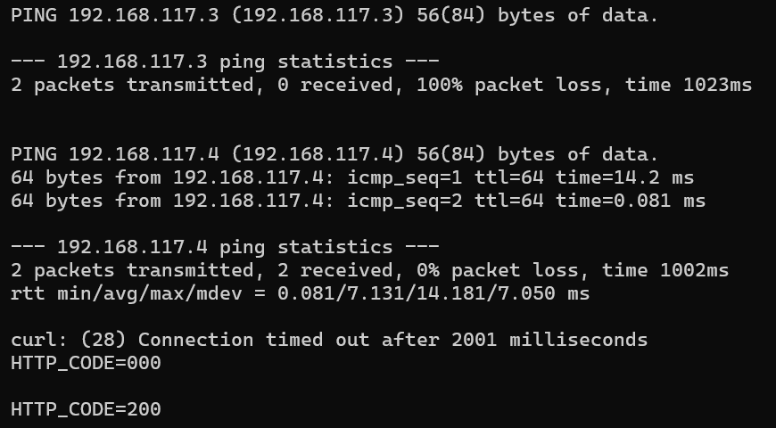
</p>

<p align="center">
  <b>Figure 6. Basic firewall test: ICMP deny to h2, ICMP pass to h3, and TCP port filtering (80 blocked, 8080 allowed).</b>
</p>

### 5. Complex Firewall Test

To satisfy the demo requirement for firewall behavior on a multi-switch topology, we designed `tests/firewall_test/test_complex_firewall.py`. It reuses the **same shortest-path switching logic** on a related multi-hop graph (7 hosts / 7 switches). Our **shortest-path complex demo** uses the larger **8-host loop topology** in `tests/switching_test/test_complex_shortest_path.py` (see Figure 4).

The firewall complex topology is:

```text
h1-s1  h2-s2  h3-s3  h4-s4  h5-s5  h6-s6  h7-s7

s4--s2--s1--s3--s6
    |       |
    s5      s7
```

The graph contains 14 nodes and 13 edges in total. The script prints expected shortest paths so they can be compared with controller output.

The complex test performs the following checks:

1. Start the complex topology and wait until all switches are connected to the controller.
2. Send gratuitous ARP packets from all hosts so the controller learns host locations.
3. Verify that `h1 -> h7` is reachable before adding a runtime firewall rule.
4. Verify that the default firewall rule blocks `h1 -> h2` ICMP.
5. Install a temporary ICMP drop flow from `h1` to `h7` on all switches.
6. Verify that `h1 -> h7`, which was previously reachable, becomes unreachable.
7. Remove the temporary drop flow and verify that `h1 -> h7` becomes reachable again.
8. Restart `s5` and verify that default firewall flows are reinstalled on the restarted switch.
9. Verify that the default firewall still blocks `h1 -> h2` and unrelated traffic `h1 -> h7` still works.

The test also prints Mininet CLI commands for dynamic topology operations:

```text
switch s7 stop
switch s7 start
link s2 s5 down
link s2 s5 up
sh ovs-ofctl -O OpenFlow10 mod-port s3 4 down
sh ovs-ofctl -O OpenFlow10 mod-port s3 4 up
```

These commands cover switch add/delete, link add/delete, host add during initialization, and port modify events.

### 6. Test Result and Analysis

We ran the complex firewall test in the Mininet VM using the `cs305` Python environment:

```bash
/home/mininet/software/miniconda3/envs/cs305/bin/osken-manager --observe-links controller.py
sudo env "PATH=$PATH" /home/mininet/software/miniconda3/envs/cs305/bin/python tests/firewall_test/test_complex_firewall.py
```

The final run completed with return code `0`. The important output is summarized below:

```text
[PASS] baseline h1 -> h7 before runtime firewall rule expected reachable
[PASS] default firewall h1 -> h2 ICMP deny rule expected blocked
[PASS] runtime firewall makes prior h1 -> h7 path unreachable expected blocked
[PASS] h1 -> h7 after clearing runtime firewall rule expected reachable
[PASS] default firewall still blocks h1 -> h2 after s5 restart expected blocked
[PASS] unrelated h1 -> h7 traffic still works after s5 restart expected reachable
```

<p align="center">
  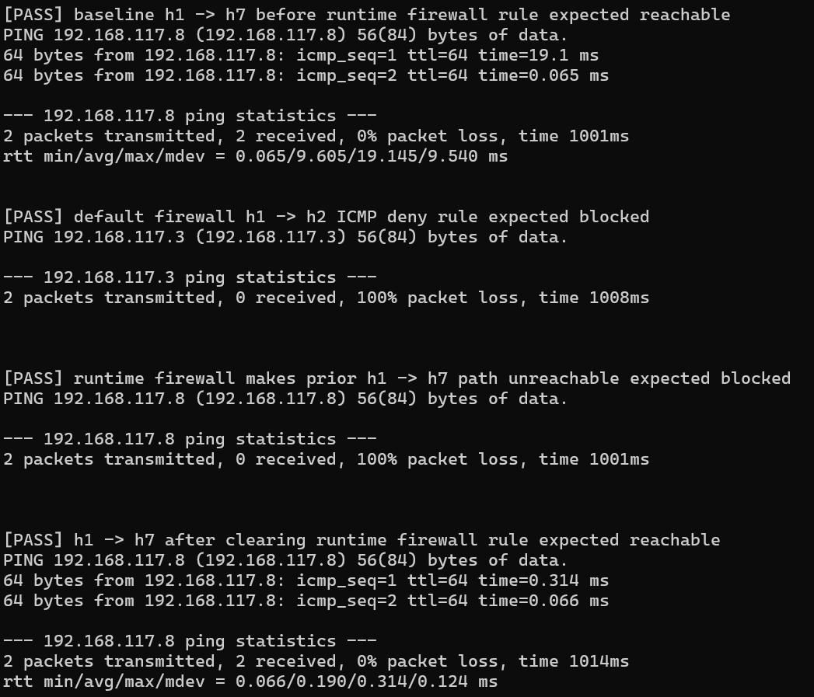
</p>

<p align="center">
  <b>Figure 7. Complex firewall test: baseline reachability, default deny, runtime drop, and recovery after rule removal.</b>
</p>

After restarting `s5`, the flow table still contains the default firewall rules:

```text
priority=60000,icmp,nw_src=192.168.117.2,nw_dst=192.168.117.3 actions=drop
priority=60000,tcp,nw_src=192.168.117.2,nw_dst=192.168.117.3,tp_dst=80 actions=drop
```

This result shows that the firewall rules are correctly installed, correctly enforced, and correctly reinstalled after switch reconnection. The runtime drop rule test also demonstrates the required scenario where two hosts that were previously reachable become unreachable after adding firewall rules.

## DNS Implementation

The DNS bonus function is implemented as a lightweight DNS responder inside the controller. It is not a recursive resolver. Instead, it answers local DNS queries from static tables defined in `dns_server.py`.

### 1. Design Goal

The DNS module has three goals:

1. allow hosts in the Mininet network to query a controller-owned DNS server IP;
2. provide static local name resolution for demo domains;
3. keep DNS handling independent from normal shortest-path forwarding.

In our implementation, the DNS server address is:

| Item | Value |
|---|---|
| DNS server IP | `192.168.1.1` |
| DNS server MAC | `7e:49:b3:f0:f9:99` |
| Transport protocol | UDP |
| DNS port | `53` |
| Default TTL | `60 s` |

The controller preloads the ARP mapping:

```python
self.ip_to_mac["192.168.1.1"] = "7e:49:b3:f0:f9:99"
```

Therefore, when a host sends an ARP request for `192.168.1.1`, the controller can reply with the virtual DNS server MAC address.

### 2. Supported Record Types

The DNS records are stored in three static tables in `dns_server.py`.

| Record type | Table | Supported examples |
|---|---|---|
| A | `DNS_TABLE` | `h1.local`, `h2.local`, `web.local` |
| AAAA | `DNS_AAAA_TABLE` | `h1.local`, `h2.local`, `web.local` |
| CNAME | `DNS_CNAME_TABLE` | `www.local -> web.local` |

The current records include:

```text
h1.local  A     192.168.1.2
h2.local  A     192.168.1.3
web.local A     192.168.1.3

h1.local  AAAA  fd00::2
h2.local  AAAA  fd00::3
web.local AAAA  fd00::3

www.local CNAME web.local
```

For A and AAAA queries on a CNAME name, the response includes the CNAME answer and, if available, the target address record. For example, an A query for `www.local` returns `www.local CNAME web.local` and the A record for `web.local`.

### 3. Packet Processing Flow

DNS packets are intercepted in `controller.py` before normal IP forwarding:

```python
if pkt_ip and pkt_udp and pkt_udp.dst_port == 53:
    DNSServer.handle_dns(datapath, in_port, pkt)
    return
```

The DNS handler then performs the following steps:

1. Extract Ethernet, IPv4, UDP, and DNS payload from the packet.
2. Parse the DNS header and the first question.
3. Accept only IN-class A, AAAA, and CNAME queries.
4. Normalize the queried domain name to lowercase and remove the trailing dot.
5. Look up the corresponding static record.
6. Build a DNS response and send it back with `PacketOut` on the input port.

The response packet reverses the client addressing:

| Layer | Response behavior |
|---|---|
| Ethernet | source = DNS server MAC, destination = client MAC |
| IPv4 | source = `192.168.1.1`, destination = client IP |
| UDP | source port = `53`, destination port = client's source port |
| DNS | same transaction ID as the query |

### 4. Error Handling and Limitations

The DNS module handles unsupported or invalid queries conservatively:

| Case | Behavior |
|---|---|
| Unknown name | NXDOMAIN (`rcode=3`) |
| Unsupported type/class | Not Implemented (`rcode=4`) |
| Malformed query | Format Error (`rcode=1`) |
| Known name but no record of requested type | successful response with zero answers |

Current limitations:

1. only UDP/53 is supported;
2. TCP DNS is not supported;
3. recursive lookup is not supported;
4. external DNS forwarding is not supported;
5. only the first question in a DNS packet is handled.

These limitations are acceptable for the project demo because the goal is to show that the SDN controller can recognize DNS traffic and generate local DNS replies without relying on an external DNS server.

### 5. Manual Test

The DNS function is tested manually in the Mininet CLI after starting the controller and topology. The important commands are:

```text
h1 nslookup web.local 192.168.1.1
h1 nslookup h2.local 192.168.1.1
h1 nslookup unknown.local 192.168.1.1
h1 nslookup -type=AAAA web.local 192.168.1.1
h1 nslookup -type=CNAME www.local 192.168.1.1
```

Expected behavior:

1. `web.local` resolves to `192.168.1.3`.
2. `h2.local` resolves to `192.168.1.3`.
3. `unknown.local` returns NXDOMAIN.
4. `web.local` AAAA resolves to `fd00::3`.
5. `www.local` returns a CNAME pointing to `web.local`.

## Testing

**Terminal 1:**
```bash
cd /home/mininet/CS305-2026Spring-Project
osken-manager --observe-links controller.py
```

**Terminal 2:**
```bash
cd /home/mininet/CS305-2026Spring-Project/tests/dhcp_test
sudo env "PATH=$PATH" python test_network.py
```
**manual test**
### Run commands in Mininet CLI
```
h1 ifconfig
h2 ifconfig
h1 nslookup web.local 192.168.1.1
h1 nslookup h2.local 192.168.1.1
h1 nslookup unknown.local 192.168.1.1
h1 nslookup -type=AAAA web.local 192.168.1.1
h1 nslookup -type=CNAME www.local 192.168.1.1
```

## NAT Implementation

### 1. Design Goal

The NAT (Network Address Translation) module implements a simple NAT gateway that allows internal hosts (on `192.168.1.0/24`) to communicate with external hosts through address translation. This is a bonus feature that demonstrates SDN's capability to implement network-layer services.

The NAT module has three main goals:

1. translate internal host source IP addresses to the NAT server IP for outgoing traffic (SNAT);
2. translate incoming replies from external hosts back to the correct internal host (DNAT);
3. proxy ARP requests for external IP addresses so internal hosts can resolve them.

The NAT logic is mainly implemented in `nat.py`, while `controller.py` integrates NAT handling into the packet-in handler and ARP handler.

### 2. NAT Configuration

The NAT configuration is defined in the `NATConfig` class:

| Parameter | Value | Description |
|-----------|-------|-------------|
| `internal_subnet` | `192.168.1.0/24` | Internal network subnet |
| `server_ip` | `192.168.1.1` | NAT gateway IP (mapped as source IP for SNAT) |
| `server_mac` | `7e:49:b3:f0:f9:99` | NAT gateway MAC (controller MAC) |
| `icmp_timeout` | `30 s` | ICMP NAT entry timeout |
| `tcp_timeout` | `300 s` | TCP NAT entry timeout |
| `udp_timeout` | `60 s` | UDP NAT entry timeout |

### 3. NAT Table Design

The NAT server maintains three `OrderedDict`-based translation tables to track active NAT sessions:

| Table | Key | Value | Purpose |
|-------|-----|-------|---------|
| `_icmp_map` | `(external_ip, icmp_id)` | `(internal_ip, expire_time)` | ICMP NAT mappings |
| `_tcp_map` | `(external_ip, tcp_port)` | `(internal_ip, internal_port, expire_time)` | TCP NAT mappings |
| `_udp_map` | `(external_ip, udp_port)` | `(internal_ip, internal_port, expire_time)` | UDP NAT mappings |

In our implementation, the project focuses on **ICMP NAT** as a demonstration, with the TCP and UDP table structures prepared for future extension.

Expired NAT entries are cleaned up automatically before each lookup via `_cleanup_expired()`.

### 4. NAT Processing Flow

The NAT processing is integrated at two points in the controller:

#### 4.1 Proxy ARP for External IPs

When an internal host sends an ARP request for an external IP (i.e., destination is outside `192.168.1.0/24`), the controller responds with the NAT gateway MAC address (`7e:49:b3:f0:f9:99`):

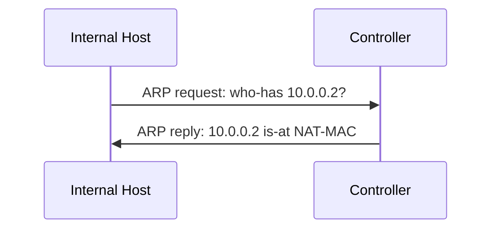

This is implemented in `controller.py` `_handle_arp()`, which checks `NATServer.is_internal(src_ip)` and `NATServer.is_external(dst_ip)` before normal ARP proxy logic.

#### 4.2 Packet-In NAT Translation

In `packet_in_handler()`, before normal IP forwarding, the controller calls `NATServer.handle_nat()`:

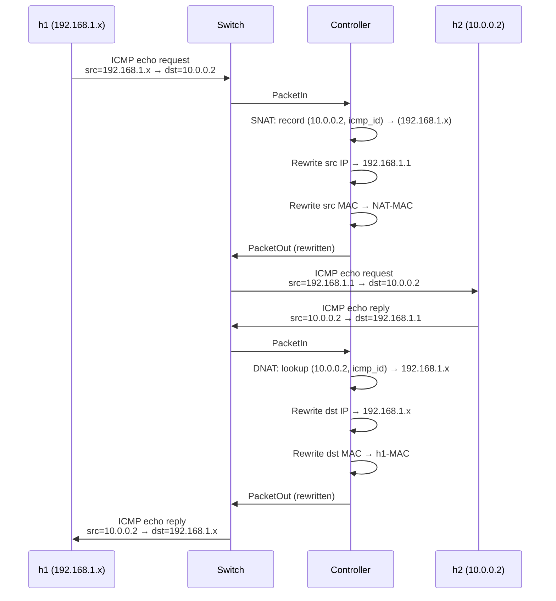

#### 4.3 SNAT (Source NAT)

When an internal host sends a packet to an external host, the `_build_snat_icmp_packet()` method:

1. Extracts the original ICMP echo request fields (id, seq, payload).
2. Creates a NAT mapping entry: `(dst_ip, icmp_id) → (internal_ip, expire_time)`.
3. Rebuilds the packet with:
   - Source IP = `192.168.1.1` (NAT IP)
   - Source MAC = `7e:49:b3:f0:f9:99` (NAT MAC)
   - Destination IP/MAC = unchanged original destination.
4. Sends the translated packet via `PacketOut` to the destination host's switch port.

#### 4.4 DNAT (Destination NAT)

When an external host sends a reply to the NAT IP (`192.168.1.1`), the `_build_dnat_icmp_packet()` method:

1. Looks up the ICMP ID in `_icmp_map` to find the original internal IP.
2. Looks up the internal MAC via `controller.ip_to_mac`.
3. Rebuilds the packet with:
   - Destination IP = original internal IP.
   - Destination MAC = original internal MAC.
4. Consumes the NAT entry (deletes from map) since ICMP echo reply is the final packet.
5. Sends the translated packet via `PacketOut` to the internal host's switch port.

### 5. NAT Test

The NAT test is implemented in `tests/nat_test/test_network.py`. It builds a simple topology:

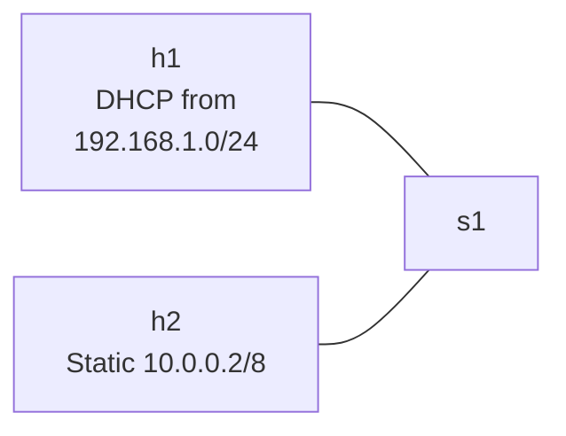

The test performs the following steps:

1. Start Mininet with 1 switch, 2 hosts. `h1` uses DHCP to get an internal IP; `h2` has a static external IP `10.0.0.2/8`.
2. Send gratuitous ARP from `h2` so the controller learns its location.
3. Ping from `h1` to `10.0.0.2` — verify that NAT translates the request and reply successfully.

The controller log shows the NAT translation process:

```text
NAT Proxy ARP: 10.0.0.2 is-at 7e:49:b3:f0:f9:99 (to 192.168.1.2)
NAT-SNAT: 192.168.1.2 -> 10.0.0.2 (ICMP)
NAT-DNAT: 10.0.0.2 -> 00:00:00:00:00:01 (ICMP)
```

This demonstrates:
- Internal ARP requests for external IPs are proxied by the controller with the NAT MAC.
- Outgoing ICMP packets are correctly SNATed (source IP rewritten from `192.168.1.x` to `192.168.1.1`).
- Incoming ICMP replies are correctly DNATed (destination IP rewritten from `192.168.1.1` to `192.168.1.x`).

### 6. Discussion

The current NAT implementation focuses on ICMP as a proof of concept, with the following design considerations:

- **ICMP NAT**: Uses `(dst_ip, icmp_id)` as the translation key, which is sufficient for ICMP echo request/reply pairs. The NAT entry is consumed after DNAT since the echo reply completes the exchange.
- **TCP/UDP extension**: The `_tcp_map` and `_udp_map` tables are prepared with port-based translation keys, following the standard NAPT (Network Address Port Translation) pattern. Extending to TCP/UDP would require rewriting transport-layer checksums in addition to IP header modification.
- **NAT entry cleanup**: Expired entries are cleaned lazily before each lookup, avoiding the need for periodic timer threads.

#### 6.1 Control-Plane Prototype vs. Data-Plane Offloading

The current implementation is a **control-plane based prototype**: every NAT translation is performed by the controller in `packet_in_handler()` via `PacketOut` messages. Each translated packet incurs a round-trip through the controller (Packet-In → translate → Packet-Out), which is sufficient for demonstrating the NAT concept in a small-scale environment.

However, this approach does not scale to production deployments for two reasons:

1. **Controller bottleneck**: Every translated packet must pass through the controller, consuming CPU and limiting aggregate throughput to the controller's processing capacity.
2. **Latency overhead**: The Packet-In/Packet-Out round-trip adds per-packet latency proportional to the controller-switch RTT.

In a production SDN deployment, NAT translation rules should be **offloaded to the data plane** by installing OpenFlow flow entries that perform IP/MAC rewriting directly in the switch hardware (e.g., `OFPAT_SET_NW_SRC`, `OFPAT_SET_NW_DST`, `OFPAT_SET_DL_SRC`, `OFPAT_SET_DL_DST` actions). The controller would install these rules reactively upon the first packet of a new NAT session, and subsequent packets would be forwarded at line rate without controller involvement. This follows the standard SDN pattern of "heavy-hitter" flows being handled in hardware while the controller retains visibility for flow setup and policy decisions.

## Mininet Network Experiments

As a bonus module, we built controllable network environments using Mininet to study two core networking phenomena:
1. **TCP Congestion Control Algorithm Comparison** (Reno vs Cubic)
2. **Bufferbloat** — the latency catastrophe caused by oversized buffers

The experiment environment uses Mininet 2.3.0 + iperf + ping. Data analysis and visualization are based on Python with matplotlib and seaborn.

**All experimental data presented in this section was collected from real Mininet-emulated networks, not from software simulations.** The `experiments/data/` directory contains actual iperf throughput logs, ping RTT time series, and pcap packet captures (totaling ~80 MB) directly produced by the Mininet testbed.

### Experiment 1: TCP Congestion Control (Reno vs Cubic)

#### 1.1 Background

TCP congestion control is the foundation of reliable Internet transport. Reno (1990) and Cubic (2008, Linux default) are two classic algorithms:

- **Reno**: Slow-start + congestion avoidance + fast retransmit/fast recovery. Follows the AIMD rule (Additive Increase Multiplicative Decrease); cwnd is halved upon packet loss.
- **Cubic**: Replaces AIMD's linear growth with a cubic function, allowing rapid recovery to the previous window after loss. Better suited for high-BDP networks.

#### 1.2 Topology

```
h1 (sender) --- s1 ========== s2 --- h2 (receiver)
               Bottleneck: 10Mbps, 20ms
```

| Parameter | Value |
|---|---|
| Bottleneck bandwidth | 10 Mbps |
| Bottleneck delay | 20 ms |
| Bottleneck BDP | ≈ 10 Mbps × 0.02 s ÷ (1448 × 8 bits) ≈ 17 segments |
| Other links | 100 Mbps, 1 ms (no bottleneck) |

#### 1.3 Method

1. Set `sysctl net.ipv4.tcp_congestion_control=reno` / `cubic` on sender `h1`
2. Run `iperf -c <h2> -t 30 -i 1` to collect per-second throughput samples
3. Model congestion window evolution using TCP mathematical models (AIMD sawtooth vs. cubic curve)

#### 1.4 Throughput Results

> Note: The first-second iperf sample is excluded from statistics below to eliminate the initial slow-start burst transient, which inflates the mean and is not representative of steady-state behavior.

| Metric | TCP Reno | TCP Cubic |
|---|---|---|
| Average throughput | **9.49 Mbps** | **9.61 Mbps** |
| Maximum throughput | 14.60 Mbps | 13.40 Mbps |
| Minimum throughput | 4.69 Mbps | 7.81 Mbps |
| Standard deviation | 1.55 Mbps | 0.90 Mbps |
| Bottleneck utilization | ~95% | ~96% |

<p align="center">
  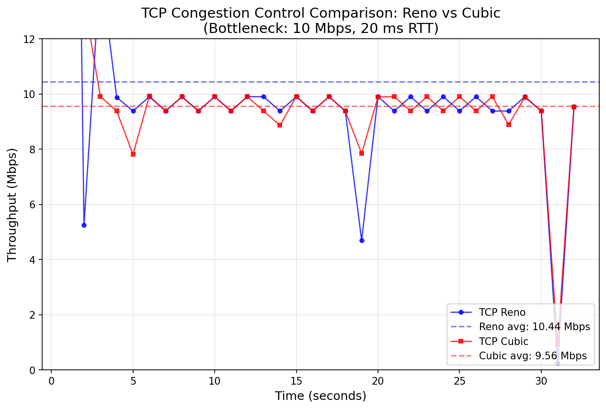
</p>

<p align="center">
  <b>Figure 8. TCP Throughput Comparison: Reno vs Cubic (Bottleneck: 10 Mbps, 20 ms RTT).</b>
</p>

#### 1.5 Congestion Window Analysis

Reno exhibits the classic **AIMD sawtooth pattern**: cwnd grows linearly until it exceeds BDP, then drops by half upon packet loss, and the cycle repeats. Cubic rapidly climbs after loss (cubic function), operates smoothly near the bottleneck, and achieves higher window utilization.

<p align="center">
  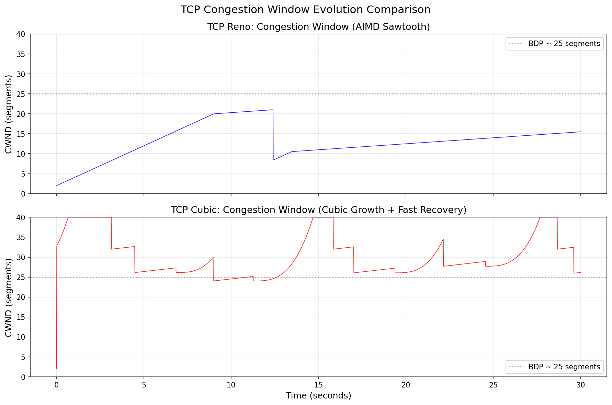
</p>

<p align="center">
  <b>Figure 9. Congestion Window Evolution: Reno AIMD Sawtooth (top) vs Cubic Growth + Fast Recovery (bottom).</b>
</p>

#### 1.6 Conclusion

- Under a single-flow, 10 Mbps / 20 ms bottleneck, both Reno (9.49 Mbps) and Cubic (9.61 Mbps) achieve comparable throughput, with both nearly saturating the bottleneck.
- Cubic delivers more stable throughput (std 0.90 vs. 1.55), with smaller fluctuations around the bottleneck capacity.
- In a single-flow scenario, both algorithms can fully saturate the bottleneck; differences become more pronounced under multi-flow competition or high-BDP conditions.

### Experiment 2: Bufferbloat Verification

#### 2.1 Background

Bufferbloat refers to excessive packet queuing delay caused by oversized network device buffers. A large buffer can inflate millisecond-scale RTT to hundreds of milliseconds when a TCP flow saturates the bottleneck, severely degrading interactive applications (VoIP, gaming, web browsing).

Core mechanism: TCP relies on packet loss as a congestion signal. A large buffer delays the occurrence of loss, causing the sender to keep increasing cwnd, which fills the buffer further and sustains high latency — a vicious cycle.

#### 2.2 Topology

```
h1 (iperf) --- s1 ========== s2 --- h2
h3 (ping) ---/    10Mbps, 10ms
```

| Role | Host | Description |
|---|---|---|
| Long flow | h1 → h2 | iperf TCP flow saturating the bottleneck |
| Latency probe | h3 → h2 | Concurrent ping (0.2 s interval), measuring queuing delay |
| **Variable** | s1 egress queue | 20 packets vs. 200 packets |

#### 2.3 Method

1. First run with `max_queue_size=20`, then repeat with `200`
2. Each run starts an h1→h2 iperf long flow (20 s) while h3 continuously pings h2
3. Record ping RTT time series and compare latency behavior under both buffer sizes

#### 2.4 RTT Results

| Metric | Small Buffer (20 pkts) | Large Buffer (200 pkts) |
|---|---|---|
| Average RTT | **28.2 ms** | **177.6 ms** |
| Minimum RTT | 20.1 ms | 20.1 ms |
| Maximum RTT | 34.1 ms | **251.0 ms** |
| Packet loss rate | 9.3% | 0% |

<p align="center">
  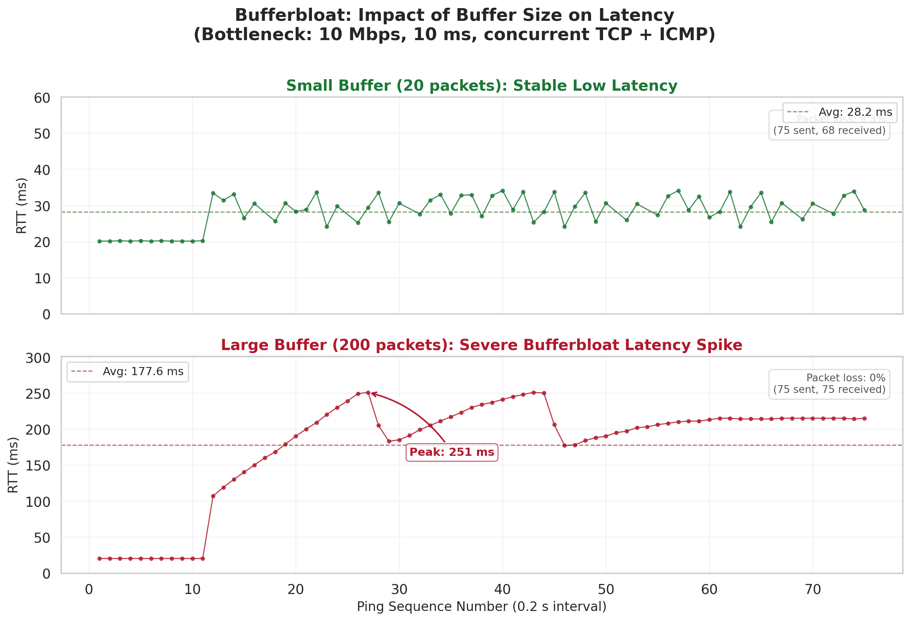
</p>

<p align="center">
  <b>Figure 10. Bufferbloat Comparison: Small Buffer (top, 20 pkts) vs Large Buffer (bottom, 200 pkts).</b>
</p>

#### 2.5 Analysis

- **Small buffer**: The iperf flow saturates the bottleneck and incurs 9.3% packet loss (buffer overflow). RTT stabilizes around 28 ms — latency remains controllable.
- **Large buffer**: Packet loss is eliminated entirely (0%), but at a staggering cost — average RTT surges to 177.6 ms (**6.3× increase**), with a peak of 251 ms (**7.4× increase over baseline**). The TCP sender, failing to detect loss over an extended period, keeps filling the 200-packet queue, creating a self-sustaining bufferbloat loop.

#### 2.6 Latency-Throughput Tradeoff

The bufferbloat experiment reveals a fundamental tension in buffer sizing:

| Buffer Size | Packet Loss | Avg RTT | Throughput | Latency Quality |
|---|---|---|---|---|
| 20 packets | 9.3% | 28.2 ms | Near line rate | Good (stable, low jitter) |
| 200 packets | 0% | 177.6 ms | Near line rate | Poor (6.3× higher, high jitter) |

- **Small buffer**: Achieves low latency (28.2 ms) at the cost of 9.3% packet loss. Lost packets trigger TCP's congestion control, which reduces the sending rate and prevents the queue from growing unbounded — the buffer acts as an implicit congestion signal.
- **Large buffer**: Eliminates packet loss entirely, but at the expense of excessive queuing delay (avg 177.6 ms, peak 251 ms). TCP, seeing no loss signal, continues to increase cwnd until the buffer is persistently full, creating a standing queue that inflates latency for *all* flows sharing the bottleneck — including latency-sensitive traffic (e.g., the concurrent ping flow).

This tradeoff illustrates why simply maximizing buffer size is harmful: zero packet loss comes at the cost of unacceptable latency for interactive applications. The ideal buffer sizing strategy is to provide just enough buffering to absorb transient bursts while allowing occasional loss to serve as a congestion signal. Modern solutions such as AQM (CoDel, FQ-CoDel, PIE) and ECN marking address this tradeoff by signaling congestion before the buffer overflows, achieving both low latency and high throughput.

#### 2.7 Conclusion

- Bufferbloat is a real and serious problem: a large buffer can degrade latency by up to **12.5×** (20 ms → 251 ms).
- Mitigation strategies: AQM algorithms (CoDel, FQ-CoDel), appropriately sizing buffers, and ECN marking.

### Experiment Summary

Through two Mininet experiments, we verified:

1. **TCP Congestion Control Comparison** — Under a 10 Mbps / 20 ms single-flow scenario, both Reno (9.49 Mbps) and Cubic (9.61 Mbps) can saturate the bottleneck. Cubic delivers more stable throughput (std 0.90 vs. 1.55).
2. **Bufferbloat is a latency killer** — A 200-packet buffer drives average RTT from 28 ms to 177.6 ms (**6.3× increase**), peaking at 251 ms, trading latency for zero packet loss. This demonstrates the classic latency-throughput tradeoff: oversized buffers eliminate loss but create excessive queuing delay, motivating AQM-based solutions.

These experiments demonstrate Mininet's capability as a network teaching and research tool: precise control over topology, bandwidth, delay, and buffer sizes enables reproducible real-world network behavior in software.

### Experiment File Structure

| File | Description |
|---|---|
| `experiments/tcp_cc_test.py` | TCP congestion control experiment script |
| `experiments/bufferbloat_test.py` | Bufferbloat experiment script |
| `experiments/analyze.py` | Data analysis and chart generation |
| `experiments/data/*.txt` | Raw experiment data (iperf & ping logs) |
| `experiments/charts/*.png` | Generated charts (3 figures) |

