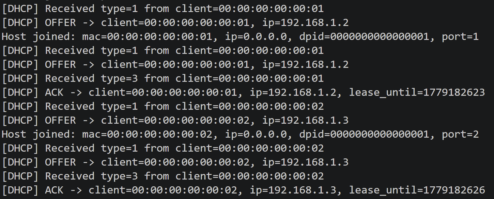
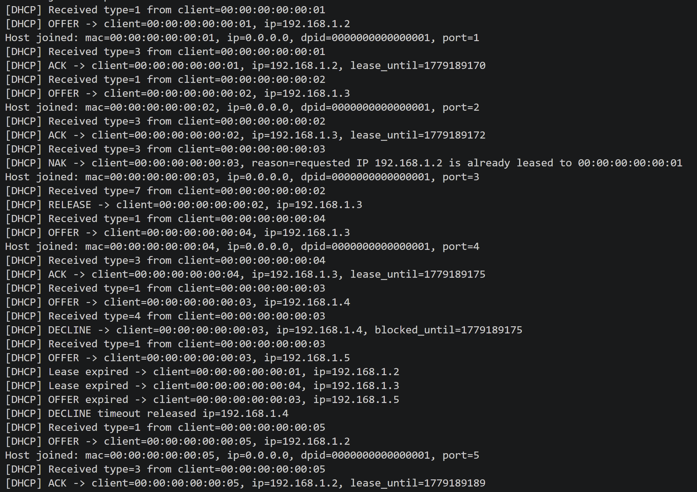

# CS305 2026Spring Project: SDN-based Network Management System
## Introduction
In this project, we developed a Software-Defined Networking (SDN) based network management system. It mainly achieves the following basic functionalities:
1. **DHCP Management**: The system can manage DHCP services, allowing administrators to configure and monitor IP address allocation.
2. **Shortest Path Routing**: The system provides intelligent routing capabilities, ensuring efficient data transmission across the network.
3. **Firewall Management**: The system provides firewall management capabilities, allowing administrators to configure and monitor network security policies.

Also, we implemented some bonus features, such as:
......

## System Architecture
```
├── controller.py  # The main file of the controller
├── dhcp.py   # Implement DHCP server here
├── firewall.py # Implement firewall here
├── ofctl_utilis.py # Don't need to modify this file, it provides useful functions for building and sending packets
├── requirements.txt 
└── tests
    ├── dhcp_test
    │   ├── test_network.py
    |   └── test_network_bonus.py   
    └── switching_test
    │   └── test_network.py
    └── firewall_test
        └── test_network.py
```
## DHCP Implementation

### 1. Design Goal

The DHCP module is responsible for assigning IP addresses to hosts that join the Mininet network without pre-configured IP addresses. In our implementation, the DHCP logic is mainly implemented in `dhcp.py`.

The DHCP module has three main goals:

1. assign a valid IP address from the configured address pool;
2. maintain the relationship between client MAC addresses and allocated IP addresses;
3. avoid duplicate IP allocation.

In addition to the basic DHCP process, we also implemented two bonus functions:

1. DHCP lease duration;
2. RFC-inspired IP allocation control, including REQUEST validation, NAK, RELEASE, and DECLINE handling.


### 2. DHCP Server State Design

The configurable DHCP parameters are defined in the `Config` class.

| Item | Value in our implementation |
|---|---|
| DHCP server IP | `192.168.1.1` |
| Address pool | `192.168.1.2` to `192.168.1.99` |
| Netmask | `255.255.255.0` |
| DNS server | `8.8.8.8` |
| Lease duration | `8 s` for demo |
| OFFER timeout | `4 s` for demo |
| DECLINE timeout | `6 s` for demo |

The short timeout values are used for demonstration. In normal use, these values can be changed to longer durations, such as `3600`, `60`, and `300` seconds.

To manage address allocation, the DHCP server maintains three kinds of states.

| State | Data structure | Purpose |
|---|---|---|
| Formal lease | `mac_to_ip`, `ip_to_mac`, `lease_expire_time` | Records IP addresses confirmed by DHCP ACK |
| Temporary OFFER | `offered_ip_by_mac`, `offered_mac_by_ip`, `offer_expire_time` | Reserves IP addresses after DHCP OFFER but before DHCP ACK |
| Declined IP | `declined_ip_until` | Temporarily blocks IP addresses declined by clients |

This state design separates temporary reservations from confirmed leases. Therefore, an IP address is not considered fully allocated after DISCOVER. It becomes a formal lease only after the server receives and accepts a DHCP REQUEST.

### 3. Basic DHCP DORA Process

Our DHCP module follows the simplified DORA workflow:

```text
DISCOVER -> OFFER -> REQUEST -> ACK
```

The main DHCP logic is implemented in `dhcp.py`. For each DHCP packet, `handle_dhcp()` cleans expired states, decodes the DHCP message type, and dispatches it to the corresponding handler.

| DHCP message | Function used | Behavior |
|---|---|---|
| DISCOVER | `_handle_discover()` | Select an available IP and send OFFER |
| REQUEST | `_handle_request()` | Validate the requested IP and send ACK or NAK |
| RELEASE | `_handle_release()` | Release an existing lease |
| DECLINE | `_handle_decline()` | Temporarily block a declined IP |

For DHCP DISCOVER, the server uses `_pick_offer_ip()` to choose an address and records it as a temporary OFFER. For DHCP REQUEST, the server uses `_validate_request_for_ack()` to check the requested IP. If the request is valid, `_commit_lease()` records the formal lease and the server sends ACK; otherwise, it sends NAK.

A normal DORA process can be observed from the controller log:

<p align="center">
  
</p>

<p align="center">
  <b>Figure 1. DHCP DORA process in the controller log</b>
</p>


### 4. IP Address Allocation Strategy and Duplicate Prevention

The server maintains three types of DHCP states:

| State | Data structure | Purpose |
|---|---|---|
| Formal lease | `mac_to_ip`, `ip_to_mac`, `lease_expire_time` | Records IP addresses confirmed by DHCP ACK |
| Temporary OFFER | `offered_ip_by_mac`, `offered_mac_by_ip`, `offer_expire_time` | Reserves IP addresses after DHCP OFFER but before DHCP ACK |
| Declined IP | `declined_ip_until` | Temporarily blocks IP addresses declined by clients |

**Bonus: duplicate IP allocation prevention.**  
To avoid duplicate allocation, the server checks IP availability in both the OFFER stage and the ACK stage.

#### 4.1 OFFER stage

When choosing an IP address, `_pick_offer_ip()` follows this priority:

1. If the client already has a valid lease, reuse the same IP.
2. If the client already has a valid OFFER, reuse the offered IP and extend its OFFER timeout.
3. Otherwise, scan the address pool and select the first available IP.

An IP address is available only when it is:

1. inside the configured address pool;
2. not leased to another MAC address;
3. not offered to another MAC address;
4. not temporarily blocked after DECLINE.

This check is implemented through `_is_ip_available_for_mac()`.

#### 4.2 ACK stage

Before sending ACK, the server validates the requested IP again. A REQUEST is accepted only when:

1. the requested IP is available;
2. the IP belongs to the same client or has no owner;
3. if the client has an active OFFER, the requested IP matches the offered IP.

If the validation fails, the server sends NAK instead of ACK.

#### 4.3 Two-stage guarantee

```text
OFFER stage:
    avoid offering the same IP to two clients

ACK stage:
    avoid confirming an invalid or occupied IP
```

After a valid REQUEST is accepted, `_commit_lease()` updates the formal lease state:

```text
mac_to_ip[client_mac] = assigned_ip
ip_to_mac[assigned_ip] = client_mac
lease_expire_time[assigned_ip] = current_time + lease_duration
```

At the same time, the temporary OFFER record is removed, keeping the lease table and offer table consistent.


### 5. DHCP Lease Duration

Each formal lease has an expiration time configured by `Config.lease_duration`.

The lease duration is implemented in two places:

1. When building DHCP OFFER and DHCP ACK packets, the server adds the lease time option:

```text
DHCP_IP_ADDR_LEASE_TIME_OPT = lease_duration
```

2. When committing a lease, the server records its expiration time in `lease_expire_time`.

Before processing each DHCP packet, `_cleanup_expired_state()` is called. If a lease has expired, it is removed from the lease tables, and the IP address becomes available again.


### 6. RFC-Inspired DHCP Behavior

Besides the basic DORA process, our implementation supports several RFC-inspired behaviors.

#### 6.1 Server identifier check

When processing DHCP REQUEST, `_handle_request()` checks the server identifier option. If the REQUEST targets another DHCP server, our server ignores it.

#### 6.2 DHCP NAK

If the requested IP is missing, outside the pool, declined, leased to another MAC, offered to another MAC, or inconsistent with the previous OFFER, `_validate_request_for_ack()` rejects it and `assemble_nak()` sends DHCP NAK.

#### 6.3 DHCP RELEASE

`_handle_release()` handles DHCP RELEASE. When a client releases its address, the server removes the corresponding records from `mac_to_ip`, `ip_to_mac`, and `lease_expire_time`.

#### 6.4 DHCP DECLINE

`_handle_decline()` handles DHCP DECLINE. When a client declines an offered IP, the server removes the temporary OFFER and stores the IP in `declined_ip_until`. During the decline timeout, this IP will not be offered again.

#### 6.5 Expired state cleanup

Before handling each DHCP packet, `_cleanup_expired_state()` cleans:

```text
expired leases
expired offers
expired declined IP records
```
### 7. Bonus Test Script

To verify the bonus DHCP functions, we designed an additional test script `test_dhcp_bonus.py`. This script focuses on the extended DHCP behaviors beyond the basic DORA process.


#### 7.1 Test Configuration

Before running the bonus test script, the following parameters in `dhcp.py` should be set to short demo values:

```python
lease_duration = 8
offer_timeout = 4
decline_timeout = 6
```

The controller and the bonus test script are started in two terminals.

**Terminal 1:**
```bash
cd /home/mininet/CS305-2026Spring-Project
osken-manager --observe-links controller.py
```

**Terminal 2:**
```bash
cd /home/mininet/CS305-2026Spring-Project/tests/dhcp_test
sudo env "PATH=$PATH" python test_dhcp_bonus.py
```

#### 7.2 Test Procedure

The bonus test script performs the following checks:

1. Start a Mininet topology with five hosts (`h1` to `h5`) and clear their initial IP addresses.
2. Verify that `h1` completes a normal DORA process and that the ACK contains the lease time option.
3. Verify that `h2` receives a different IP address from `h1`.
4. Verify that `h3` requests an occupied IP and receives DHCP NAK.
5. Verify that after `h2` sends DHCP RELEASE, the released IP can be reassigned to `h4`.
6. Verify that after `h3` sends DHCP DECLINE, the same IP is not immediately re-offered.
7. Wait for lease expiration and verify that the expired IP can be reassigned to `h5`.

#### 7.3 Test Result and Analysis

Figure 2 shows the controller log generated during the execution of the bonus test script.

<p align="center">
  
</p>

<p align="center">
  <b>Figure 2. Controller log of the DHCP bonus test script.</b>
</p>

From Figure 2, the following results can be observed:

1. **Normal DORA process**:  
   `h1` receives `192.168.1.2`, and `h2` receives `192.168.1.3`, showing that the DHCP server can complete the basic allocation process correctly.

2. **Duplicate IP prevention**:  
   When client `00:00:00:00:00:03` requests `192.168.1.2`, the server returns  
   `NAK -> ... requested IP 192.168.1.2 is already leased to 00:00:00:00:00:01`,  
   which shows that occupied addresses are not incorrectly reassigned.

3. **DHCP RELEASE**:  
   After client `00:00:00:00:00:02` releases `192.168.1.3`, the same address is later offered to and confirmed for client `00:00:00:00:00:04`.  
   This shows that released leases can be reused.

4. **DHCP DECLINE**:  
   Client `00:00:00:00:00:03` first receives OFFER `192.168.1.4`, then sends DECLINE.  
   The controller records  
   `DECLINE -> ... ip=192.168.1.4, blocked_until=...`,  
   and the next OFFER for this client becomes `192.168.1.5` instead of `192.168.1.4`.  
   This shows that declined IPs are temporarily quarantined.

5. **Lease expiration and reclamation**:  
   The controller later prints  
   `Lease expired -> client=00:00:00:00:00:01, ip=192.168.1.2`  
   and  
   `Lease expired -> client=00:00:00:00:00:04, ip=192.168.1.3`.  
   After that, client `00:00:00:00:00:05` is offered `192.168.1.2` and successfully ACKed.  
   This demonstrates that expired leases are correctly reclaimed and returned to the address pool.

6. **Temporary OFFER timeout and DECLINE timeout**:  
   The log also shows  
   `OFFER expired -> client=00:00:00:00:00:03, ip=192.168.1.5`  
   and  
   `DECLINE timeout released ip=192.168.1.4`,  
   indicating that the server correctly cleans expired temporary states.

## Firewall Implementation

### 1. Design Goal

The firewall module is responsible for filtering selected network traffic inside the SDN network. Instead of installing filtering logic on each host, the controller reads firewall rules and installs high-priority OpenFlow drop rules on the switches.

The firewall module has three main goals:

1. parse firewall rules from a JSON configuration file;
2. translate deny rules into OpenFlow flow entries;
3. make sure firewall rules remain effective after switch reconnection.

In our implementation, the firewall logic is mainly implemented in `firewall.py`, while `controller.py` calls the firewall module when a switch joins the controller.

### 2. Firewall Rule Design

Each firewall rule is represented by a `FirewallRule` object. A rule can specify source IP, destination IP, protocol, source port, destination port, and action.

| Field | Meaning |
|---|---|
| `src_ip` | Source IP address |
| `dst_ip` | Destination IP address |
| `proto` | Network protocol, such as `icmp`, `tcp`, or `udp` |
| `src_port` | Source transport-layer port |
| `dst_port` | Destination transport-layer port |
| `action` | Rule action. The project mainly uses `deny` |

The rule file is loaded from `firewall_rules.json`. If this file does not exist, the module falls back to `firewall_rule.json`, which is the rule file used in our project. If no rule file is found, the firewall uses default deny rules.

The default firewall rules block:

1. ICMP traffic from `192.168.117.2` to `192.168.117.3`;
2. TCP traffic from `192.168.117.2` to `192.168.117.3` with destination port `80`.

For wildcard fields, the firewall treats `None`, empty string, `*`, and `any` as match-any values. Protocol names are normalized into OpenFlow protocol numbers:

| Protocol | OpenFlow value |
|---|---|
| `icmp` | `1` |
| `tcp` | `6` |
| `udp` | `17` |

### 3. OpenFlow Rule Installation

When a switch joins the controller, `controller.py` creates an `OfCtl` object for the switch and calls:

```python
self.firewall.reset_switch(dpid)
self.firewall.install_rules({dpid: ofctl})
```

For each valid `deny` rule, the firewall installs a high-priority OpenFlow flow entry:

```text
priority = 60000
dl_type  = IPv4
nw_src   = rule source IP
nw_dst   = rule destination IP
nw_proto = ICMP / TCP / UDP
tp_src   = source port if specified
tp_dst   = destination port if specified
actions  = []
```

An empty action list means that the switch drops matched packets directly. This priority is higher than the normal forwarding priority (`1000`), so firewall rules are checked before shortest-path forwarding rules.

The firewall also keeps an `installed` set to avoid repeatedly installing the same rule on the same switch. However, a switch restart clears the switch flow table. To handle this case, `reset_switch(dpid)` removes cached installation records for that switch before reinstalling the rules. This ensures that after `switch stop/start`, the firewall drop flows are installed again.

### 4. Basic Firewall Test

The basic firewall test is implemented in `tests/firewall_test/test_network.py`. It builds a simple topology with three hosts and one switch:

```text
h1 ---\
h2 ---- s1
h3 ---/
```

The hosts use manually configured IP addresses:

| Host | IP address |
|---|---|
| `h1` | `192.168.117.2` |
| `h2` | `192.168.117.3` |
| `h3` | `192.168.117.4` |

The test starts HTTP servers on `h2` at port `80` and port `8080`, then checks four cases:

| Test case | Expected result | Reason |
|---|---|---|
| `h1 -> h2` ICMP | Fail | Blocked by the ICMP deny rule |
| `h1 -> h3` ICMP | Pass | No rule blocks this traffic |
| `h1 -> h2` TCP/80 | Fail | Blocked by the TCP port 80 deny rule |
| `h1 -> h2` TCP/8080 | Pass | Port 8080 is not blocked |

This test verifies that the firewall can distinguish traffic by IP address, protocol, and transport-layer port.

### 5. Complex Firewall Test

To satisfy the demo requirement for a larger topology, we also designed `tests/firewall_test/test_complex_firewall.py`. This test uses seven hosts and seven switches:

```text
h1-s1  h2-s2  h3-s3  h4-s4  h5-s5  h6-s6  h7-s7

s4--s2--s1--s3--s6
    |       |
    s5      s7
```

The graph contains 14 nodes and 13 edges in total, including host-switch links and switch-switch links. The script prints the expected shortest paths between switch pairs and host pairs, so the printed paths can be compared with the controller output.

The complex test performs the following checks:

1. Start the complex topology and wait until all switches are connected to the controller.
2. Send gratuitous ARP packets from all hosts so the controller learns host locations.
3. Verify that `h1 -> h7` is reachable before adding a runtime firewall rule.
4. Verify that the default firewall rule blocks `h1 -> h2` ICMP.
5. Install a temporary ICMP drop flow from `h1` to `h7` on all switches.
6. Verify that `h1 -> h7`, which was previously reachable, becomes unreachable.
7. Remove the temporary drop flow and verify that `h1 -> h7` becomes reachable again.
8. Restart `s5` and verify that default firewall flows are reinstalled on the restarted switch.
9. Verify that the default firewall still blocks `h1 -> h2` and unrelated traffic `h1 -> h7` still works.

The test also prints Mininet CLI commands for dynamic topology operations:

```text
switch s7 stop
switch s7 start
link s2 s5 down
link s2 s5 up
sh ovs-ofctl -O OpenFlow10 mod-port s3 4 down
sh ovs-ofctl -O OpenFlow10 mod-port s3 4 up
```

These commands cover switch add/delete, link add/delete, host add during initialization, and port modify events.

### 6. Test Result and Analysis

We ran the complex firewall test in the Mininet VM using the `cs305` Python environment:

```bash
/home/mininet/software/miniconda3/envs/cs305/bin/osken-manager --observe-links controller.py
sudo env "PATH=$PATH" /home/mininet/software/miniconda3/envs/cs305/bin/python tests/firewall_test/test_complex_firewall.py
```

The final run completed with return code `0`. The important output is summarized below:

```text
[PASS] baseline h1 -> h7 before runtime firewall rule expected reachable
[PASS] default firewall h1 -> h2 ICMP deny rule expected blocked
[PASS] runtime firewall makes prior h1 -> h7 path unreachable expected blocked
[PASS] h1 -> h7 after clearing runtime firewall rule expected reachable
[PASS] default firewall still blocks h1 -> h2 after s5 restart expected blocked
[PASS] unrelated h1 -> h7 traffic still works after s5 restart expected reachable
```

After restarting `s5`, the flow table still contains the default firewall rules:

```text
priority=60000,icmp,nw_src=192.168.117.2,nw_dst=192.168.117.3 actions=drop
priority=60000,tcp,nw_src=192.168.117.2,nw_dst=192.168.117.3,tp_dst=80 actions=drop
```

This result shows that the firewall rules are correctly installed, correctly enforced, and correctly reinstalled after switch reconnection. The runtime drop rule test also demonstrates the required scenario where two hosts that were previously reachable become unreachable after adding firewall rules.

## DNS Implementation

Only support UDP/53 A record queries, and answers are generated from a static table in `dns_server.py`. Unknown names return NXDOMAIN (or a formatted failure response). No recursion, no external DNS, and no TCP DNS are supported.

## Testing

**Terminal 1:**
```bash
cd /home/mininet/CS305-2026Spring-Project
osken-manager --observe-links controller.py
```

**Terminal 2:**
```bash
cd /home/mininet/CS305-2026Spring-Project/tests/dhcp_test
sudo env "PATH=$PATH" python test_network.py
```
**manual test**
### Run commands in Mininet CLI
```
h1 ifconfig
h2 ifconfig
h1 nslookup web.local 192.168.1.1
h1 nslookup h2.local 192.168.1.1
h1 nslookup unknown.local 192.168.1.1
h1 nslookup -type=AAAA web.local 192.168.1.1
h1 nslookup -type=CNAME www.local 192.168.1.1
```
